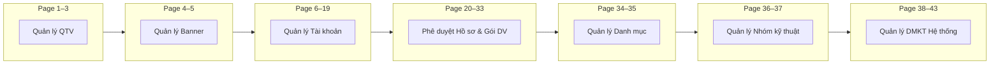
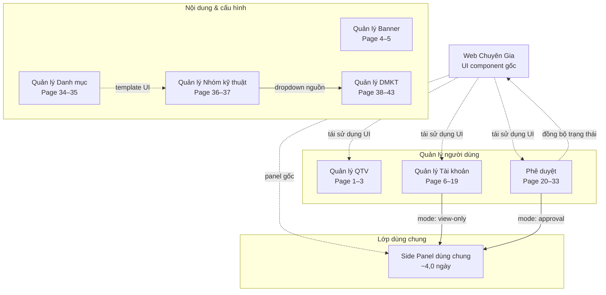
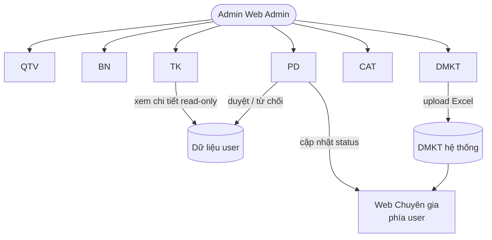

# Tổng hợp nhóm Module

> Gộp Page 10–19 vào Quản lý Tài khoản; tách Side Panel dùng chung để khử trùng estimate.

## Sơ đồ tổng quan hệ thống

### Bản đồ module theo Page (Phase 1)

> Thứ tự Page phản ánh cấu trúc requirement từ khách — không phải thứ tự triển khai.

### Lớp dùng chung & phụ thuộc giữa các module

### Luồng dữ liệu chính (tóm tắt)

---

## Danh sách Module

### 0. Side Panel dùng chung (Cross-cutting)

| Trường | Giá trị |
|--------|---------|
| **Pages** | 9–19 (chỉ xem), 24–32 (phê duyệt) |
| **Mô tả** | Thư viện side panel tái sử dụng từ Web Chuyên Gia |
| **Luồng** | Render theo `panelType` + `mode` (`view-only` \| `approval`) |
| **Ước lượng FE** | ~4,0 ngày |

---

### 1. Quản lý QTV

| Trường | Giá trị |
|--------|---------|
| **Pages** | 1–3 |
| **Mô tả** | Quản lý tài khoản và phân quyền quản trị viên |
| **Luồng** | Danh sách → chi tiết → thêm/sửa/xóa → phân quyền |
| **Ước lượng FE** | ~9,6 ngày |

---

### 2. Quản lý Banner

| Trường | Giá trị |
|--------|---------|
| **Pages** | 4–5 |
| **Mô tả** | Quản lý banner trên 4 nền tảng |
| **Luồng** | Danh sách → cập nhật nội dung |
| **Ước lượng FE** | ~5,4 ngày |

---

### 3. Quản lý Tài khoản

| Trường | Giá trị |
|--------|---------|
| **Pages** | 6–19 |
| **Mô tả** | Danh sách tài khoản user, thao tác theo trạng thái, khóa/tạm khóa, side panel |
| **Luồng** | 6–8: bảng + menu theo trạng thái; 9–19: side panel read-only (a→k) |
| **Phụ thuộc** | Side Panel dùng chung (`view-only`) |
| **Ước lượng FE** | ~6,0 ngày |

---

### 4. Phê duyệt Hồ sơ & Gói dịch vụ

| Trường | Giá trị |
|--------|---------|
| **Pages** | 20–33 |
| **Mô tả** | Duyệt hồ sơ cơ sở và gói dịch vụ |
| **Luồng** | 20–23: danh sách; 24–32: side panel; 33: duyệt/từ chối + đồng bộ trạng thái |
| **Phụ thuộc** | Side Panel dùng chung (`approval`) |
| **Ước lượng FE** | ~11,0 ngày |

---

### 5. Quản lý Danh mục

| Trường | Giá trị |
|--------|---------|
| **Pages** | 34–35 |
| **Mô tả** | Danh mục lớn — bảng và modal CRUD |
| **Ước lượng FE** | ~4,5 ngày |

---

### 6. Quản lý Nhóm kỹ thuật

| Trường | Giá trị |
|--------|---------|
| **Pages** | 36–37 |
| **Mô tả** | Nhóm kỹ thuật — tái sử dụng UI Quản lý Danh mục |
| **Phụ thuộc** | Quản lý Danh mục |
| **Ước lượng FE** | ~2,5 ngày |

---

### 7. Quản lý DMKT Hệ thống

| Trường | Giá trị |
|--------|---------|
| **Pages** | 38–43 |
| **Mô tả** | DMKT — upload Excel, validate, preview, chỉnh sửa bảng |
| **Phụ thuộc** | Quản lý Nhóm kỹ thuật |
| **Ước lượng FE** | ~12,0 ngày |

---

## Ánh xạ Page → Module

| Page | Mục requirement | Module |
|------|-----------------|--------|
| 1–3 | 1. Quản lý QTV | Quản lý QTV |
| 4–5 | 2. Quản lý Banner | Quản lý Banner |
| 6–8 | 3.1–3.4 Quản lý tài khoản | Quản lý Tài khoản |
| 9–19 | 3.5 Side panel (a→k) | Quản lý Tài khoản + Side Panel dùng chung |
| 20–21 | 4.1–4.2 Phê duyệt hồ sơ cơ sở | Phê duyệt |
| 22–23 | 4.3–4.4 Phê duyệt gói DV | Phê duyệt |
| 24–32 | 4.5 Xem chi tiết | Phê duyệt + Side Panel dùng chung |
| 33 | 4.6 Action duyệt | Phê duyệt |
| 34–35 | 5. Quản lý danh mục | Quản lý Danh mục |
| 36–37 | 6. Quản lý nhóm kỹ thuật | Quản lý Nhóm kỹ thuật |
| 38–43 | 7. Quản lý DMKT hệ thống | Quản lý DMKT Hệ thống |

## Tổng ước lượng FE

**~55,0 ngày** (1 Senior) — chi tiết xem [estimate-summary.md](estimate-summary.md)
