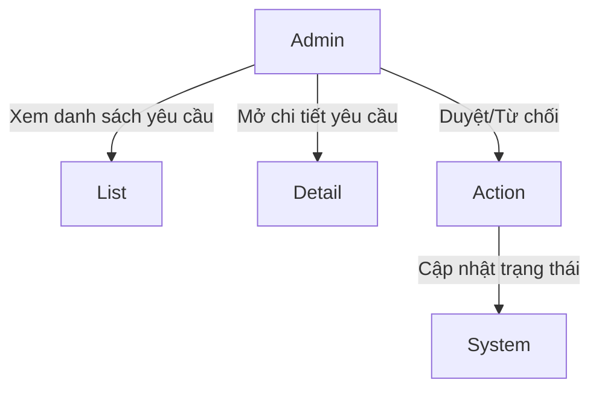
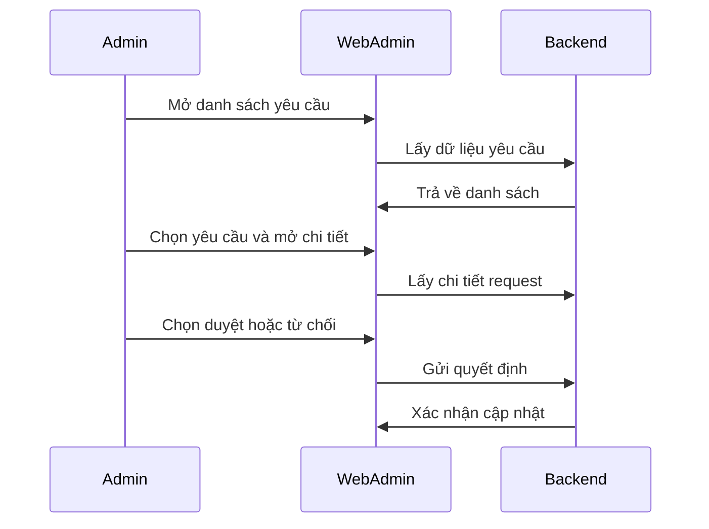
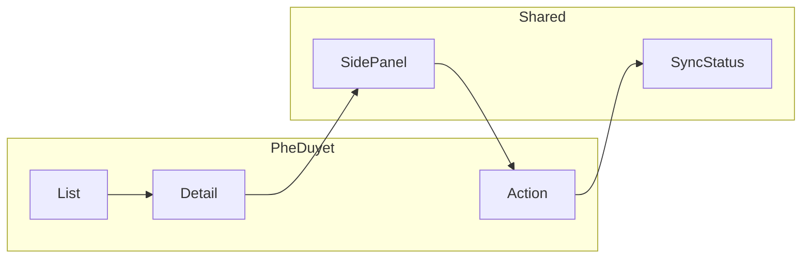

# Module: Phê duyệt hồ sơ & gói dịch vụ

## Nội dung chính
Module này xử lý quy trình phê duyệt hai luồng nghiệp vụ chính: phê duyệt hồ sơ cơ sở và phê duyệt gói dịch vụ. Web Admin cung cấp danh sách yêu cầu, bảng chi tiết và side panel xem chi tiết theo từng loại đối tượng để admin có thể duyệt hoặc từ chối, đồng thời cập nhật trạng thái phản ánh trên cả trang admin và web chuyên gia của user.

## Page liên quan
- Page 20: Danh sách yêu cầu phê duyệt hồ sơ cơ sở, dẫn đến bảng chi tiết ở Page 21.
- Page 21: Bảng chi tiết yêu cầu phê duyệt hồ sơ cơ sở.
- Page 22: Danh sách yêu cầu phê duyệt gói dịch vụ, UI tương tự Page 20 nhưng khác data "Đối tượng xét duyệt".
- Page 23: Bảng chi tiết yêu cầu phê duyệt gói dịch vụ, UI tương tự Page 21.
- Page 24: Xem chi tiết yêu cầu phê duyệt Chăm sóc tại nhà với side panel tái sử dụng từ web chuyên gia.
- Page 25: Xem chi tiết yêu cầu phê duyệt Tư vấn online.
- Page 26: Xem chi tiết yêu cầu phê duyệt Phòng mạch.
- Page 27: Xem chi tiết yêu cầu phê duyệt Profile chuyên gia.
- Page 28: Xem chi tiết yêu cầu phê duyệt Cơ sở y khoa.
- Page 29: Xem chi tiết yêu cầu phê duyệt Trung tâm xét nghiệm.
- Page 30: Xem chi tiết yêu cầu phê duyệt Nhà thuốc.
- Page 31: Xem chi tiết yêu cầu phê duyệt Cửa hàng.
- Page 32: Xem chi tiết yêu cầu phê duyệt Gói dịch vụ.
- Page 33: Action duyệt/từ chối, bắt buộc nhập note khi từ chối và cập nhật trạng thái.

## Image Analysis (auto-generated)

- Page 20:
  - 20.1.png
  - 20.2.png
- Page 21:
  - 21.1.png
- Page 22:
  - 22.1.png
- Page 23:
  - 23.1.png
- Page 24:
  - 24.1.png
- Page 25:
  - 25.1.png
- Page 26:
  - 26.1.png
- Page 27:
  - 27.1.png
- Page 28:
  - 28.1.png
- Page 29:
  - 29.1.png
- Page 30:
  - 30.1.png
- Page 31:
  - 31.1.png
- Page 32:
  - 32.1.png
- Page 33:
  - 33.1.png
  - 33.2.png

> Note: review each image and fill UI Elements / Visual cues accordingly.

## Requirement được phát hiện
| ID | Requirement | Loại | Actor liên quan | Mức độ rõ ràng |
|---|---|---|---|---|
| REQ-PHE-001 | Web Admin hiển thị danh sách yêu cầu phê duyệt hồ sơ cơ sở. | Functional | Admin | Clear |
| REQ-PHE-002 | Web Admin hiển thị bảng chi tiết yêu cầu phê duyệt hồ sơ cơ sở. | Functional | Admin | Clear |
| REQ-PHE-003 | Web Admin hiển thị danh sách yêu cầu phê duyệt gói dịch vụ với UI tương tự nhưng khác data đối tượng xét duyệt. | Functional | Admin | Clear |
| REQ-PHE-004 | Web Admin hiển thị bảng chi tiết yêu cầu phê duyệt gói dịch vụ. | Functional | Admin | Clear |
| REQ-PHE-005 | Admin có thể mở side panel xem chi tiết từng loại đối tượng và thực hiện duyệt hoặc từ chối. | Functional | Admin | Clear |
| REQ-PHE-006 | Nếu từ chối duyệt, admin phải nhập note lý do chi tiết. | Business Rule | Admin | Clear |
| REQ-PHE-007 | Khi admin thay đổi trạng thái duyệt/từ chối, cả trang admin và trang web chuyên gia của user phải cập nhật theo trạng thái mới. | Functional | Admin, User | Clear |

## Business Rule
- BR-PHE-001: Nếu admin chọn "Từ chối duyệt", phải nhập note lý do chi tiết trước khi gửi.
- BR-PHE-002: Status của mục xét duyệt trên Web Admin phải đồng bộ với trạng thái trên web chuyên gia của user.
- BR-PHE-003: Admin chỉ có thể duyệt hoặc từ chối trên các yêu cầu đã được hiển thị trong danh sách và xem chi tiết.
- BR-PHE-004: Side panel chi tiết phải tái sử dụng giao diện đã có trên web chuyên gia.

## Dữ liệu liên quan
| Data Object | Field / Attribute | Mô tả | Bắt buộc? | Ghi chú |
|---|---|---|---|---|
| ApprovalRequest | requestId | ID yêu cầu phê duyệt | Yes | Khoá duy nhất |
| ApprovalRequest | requestType | Loại yêu cầu (hồ sơ cơ sở / gói dịch vụ) | Yes | Xác định luồng xử lý |
| ApprovalRequest | subjectType | Đối tượng xét duyệt (Chăm sóc tại nhà, Tư vấn online, v.v.) | Yes | Dùng để hiển thị side panel tương ứng |
| ApprovalRequest | status | Trạng thái hiện tại (Đã xét duyệt / Từ chối duyệt / Chờ duyệt) | Yes | Đồng bộ trên admin và user |
| ApprovalRequest | rejectionNote | Lý do từ chối | Conditional | Bắt buộc khi status = Từ chối duyệt |
| ApprovalRequest | decisionBy | Người duyệt | Yes | Thông tin admin thực hiện |
| ApprovalRequest | lastUpdated | Thời gian cập nhật trạng thái | Yes | |
| ApprovalRequest | relatedData | Dữ liệu chi tiết liên quan đến đối tượng | No | Có thể là profile chuyên gia, cơ sở y khoa, gói dịch vụ, v.v. |

## Actor / Role liên quan
- Actor: Admin Web Admin
- Vai trò: Người duyệt yêu cầu phê duyệt hồ sơ cơ sở và gói dịch vụ.
- Quyền hoặc hành động được phép thực hiện:
  - Xem danh sách yêu cầu phê duyệt.
  - Mở bảng chi tiết yêu cầu.
  - Xem side panel chi tiết từng loại đối tượng.
  - Duyệt yêu cầu.
  - Từ chối yêu cầu và nhập note lý do.
  - Cập nhật trạng thái đồng bộ trên hệ thống.

## Assumption
- Side panel chi tiết đã được FE xây dựng sẵn trên web chuyên gia và chỉ cần tái sử dụng tại Web Admin.
- Các page 24-32 là các biến thể của cùng một màn hình xem chi tiết, chỉ khác nội dung dữ liệu theo loại đối tượng.
- Admin có thể thực hiện cả chức năng "Approval" và "Data correction" trong cùng một luồng duyệt.
- Trạng thái mới phải áp dụng đồng thời cho cả web admin và UI của user trên web chuyên gia.

## Open Questions
- Khi admin chỉnh sửa dữ liệu trong side panel, dữ liệu nào được phép sửa và dữ liệu nào chỉ đọc?
- Có cần lưu lại lịch sử thay đổi trạng thái duyệt/từ chối không?
- Với các yêu cầu gói dịch vụ, hệ thống có cần hiển thị chi tiết khác biệt nào so với hồ sơ cơ sở ngoài "Đối tượng xét duyệt"?
- Có yêu cầu phân quyền chi tiết cho người dùng admin khác nhau trong module này không?
- Side panel chi tiết có cần hiển thị danh sách phụ trợ (ví dụ các giấy tờ liên quan hay hồ sơ y tế) hay chỉ nội dung chính?

## Mermaid diagrams
### Use Case Diagram

### Business Flow Diagram

### Sequence Diagram

### Module Dependency Diagram

## Gap Analysis
- Chưa rõ ràng mức độ khác biệt hiển thị giữa phê duyệt hồ sơ cơ sở và phê duyệt gói dịch vụ ngoài dữ liệu "Đối tượng xét duyệt".
- Chưa xác định rõ quyền và phân quyền admin trong thao tác duyệt.
- Chưa nêu cụ thể các trường dữ liệu cần sửa trong tính năng Data correction.

## Đề xuất kiến trúc sơ bộ
- Frontend:
  - Module danh sách phê duyệt
  - Module bảng chi tiết
  - Component side panel chi tiết tái sử dụng
  - Component action duyệt/từ chối
- Backend:
  - API lấy danh sách yêu cầu phê duyệt
  - API lấy chi tiết yêu cầu phê duyệt
  - API thực hiện duyệt/từ chối với note lý do
  - API đồng bộ trạng thái admin/user
- Data:
  - Bảng `approval_requests` chung cho cả hồ sơ cơ sở và gói dịch vụ
  - Bảng `approval_status_history` nếu cần theo dõi thay đổi trạng thái
  - Bảng `approval_subjects` quản lý dữ liệu chi tiết theo loại đối tượng

## Hidden requirements & Edge cases
- Concurrency: hai admin có thể thao tác đồng thời trên cùng một request — UI phải xử lý conflict (stale data, trả về HTTP 409) và hiển thị tùy chọn `Reload`/`View diff`.
- Attachments: preview và render file (image/pdf) phải hỗ trợ tập tin lớn, validate `mime/type` và `maxSize` trước khi upload.
- Partial data correction: admin có thể sửa một số trường trước khi approve — cần danh sách `editable fields` rõ ràng và `validation rules` cho mỗi field.
- Offline/slow networks: cần có `optimistic UI` cho action approve/reject và rollback khi API trả lỗi.
- Idempotency: đảm bảo retry không gây duplicated actions; hỗ trợ `idempotencyKey` khi gọi decision API.
- Audit/history: nếu yêu cầu lưu lịch sử duyệt, chuẩn bị support `approval_status_history` và API để truy vấn `audit trail`.
- Pagination & large lists: dùng `server-side pagination` và `search` để tránh client-side full-load trên large datasets.

## Implementation breakdown (frontend tasks)
- [UI][Medium] `ApprovalList` component: table với columns, filters và server-side pagination/search. Est: 3–5d
- [UI][Medium] `ApprovalDetailPanel` (side panel): hiển thị `relatedData` theo `subjectType`, preview attachments, và hỗ trợ chế độ read-only hoặc limited edit (theo cấu hình). Est: 2–4d
- [UI][Small] `ApprovalActions` (Approve/Reject + confirm modal + required rejection note). Est: 1–2d
- [Feature][Small] `AttachmentsPreview` component: image/pdf viewer + validation trước upload. Est: 1–2d

<!-- Note: Integration, testing, and accessibility tasks intentionally excluded from this breakdown per request. -->

## FE Estimate (single senior FE)
- Sum (mid ranges): 10d
- Contingency 20%: 2d
- Total FE estimate: ~12d

