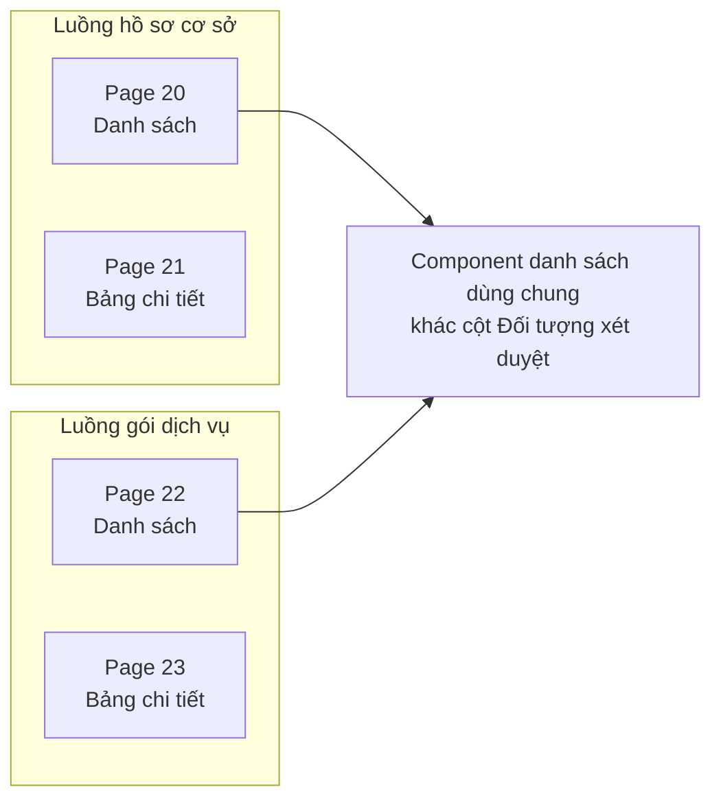
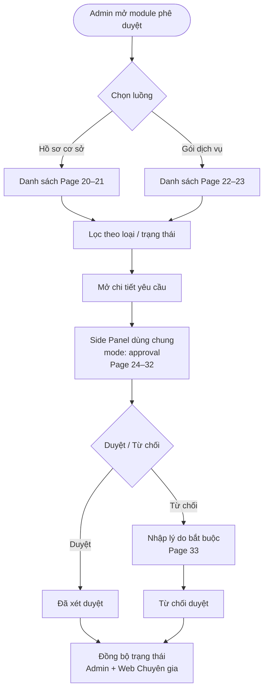
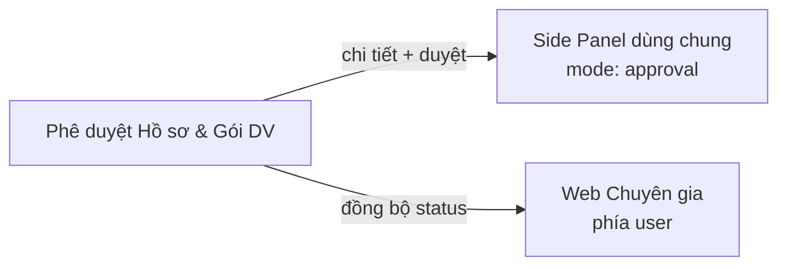

# Module: Phê duyệt Hồ sơ & Gói dịch vụ

| Trường           | Giá trị                                                            |
| ---------------- | ------------------------------------------------------------------ |
| **Pages**        | 20–33                                                              |
| **Ước lượng FE** | ~11,0 ngày (chưa gồm Side Panel dùng chung ~4,0 ngày)              |
| **User Story**   | PDHS_US1 – PDHS_US6                                                |
| **Phụ thuộc**    | [Side Panel dùng chung](shared-detail-panel.md) — `mode: approval` |

## Tổng quan

Hai luồng phê duyệt: **hồ sơ cơ sở** (Page 20–21) và **gói dịch vụ** (Page 22–23). Admin xem chi tiết qua side panel, duyệt/từ chối; trạng thái đồng bộ giữa Web Admin và Web Chuyên gia của người dùng `[ĐÃ XÁC NHẬN]`.

## Page liên quan

| Page  | Nội dung                                                                       |
| ----- | ------------------------------------------------------------------------------ |
| 20–21 | Danh sách + bảng chi tiết phê duyệt hồ sơ cơ sở                                |
| 22–23 | Danh sách + bảng chi tiết gói DV (UI giống 20–21)                              |
| 24–32 | Side panel chi tiết theo đối tượng (phê duyệt + chỉnh sửa dữ liệu `[CHƯA RÕ]`) |
| 33    | Duyệt/từ chối; lý do bắt buộc khi từ chối; đồng bộ trạng thái                  |

## Yêu cầu chức năng

| ID          | Mô tả                                                       | Loại      | Nguồn   | Mức độ      |
| ----------- | ----------------------------------------------------------- | --------- | ------- | ----------- |
| REQ-PHE-001 | Danh sách yêu cầu phê duyệt hồ sơ cơ sở                     | Chức năng | Page 20 | Rõ          |
| REQ-PHE-002 | Bảng chi tiết hồ sơ cơ sở                                   | Chức năng | Page 21 | Rõ          |
| REQ-PHE-003 | Danh sách gói DV — UI giống, khác cột "Đối tượng xét duyệt" | Chức năng | Page 22 | Rõ          |
| REQ-PHE-004 | Bảng chi tiết gói DV                                        | Chức năng | Page 23 | Rõ          |
| REQ-PHE-005 | Side panel tái sử dụng Web Chuyên Gia                       | Chức năng | Page 24 | Rõ          |
| REQ-PHE-006 | Phê duyệt + chỉnh sửa dữ liệu trong cùng luồng              | Chức năng | Page 24 | `[CHƯA RÕ]` |
| REQ-PHE-007 | Từ chối → bắt buộc nhập lý do                               | Quy tắc   | Page 33 | Rõ          |
| REQ-PHE-008 | Đồng bộ trạng thái admin/user sau duyệt/từ chối             | Chức năng | Page 33 | Rõ          |

## Quy tắc nghiệp vụ

- BR-PHE-001 `[ĐÃ XÁC NHẬN]`: Từ chối duyệt bắt buộc nhập lý do.
- BR-PHE-002 `[ĐÃ XÁC NHẬN]`: Trạng thái trên admin và Web Chuyên gia user phải đồng bộ.
- BR-PHE-003 `[ĐÃ XÁC NHẬN]`: Side panel tái sử dụng UI Web Chuyên Gia.
- BR-PHE-004 `[CHƯA RÕ]`: Trường nào được sửa khi chỉnh sửa dữ liệu phê duyệt.

## Dữ liệu liên quan `[GIẢ ĐỊNH]`

| Đối tượng       | Trường        | Mô tả                              | Bắt buộc     |
| --------------- | ------------- | ---------------------------------- | ------------ |
| ApprovalRequest | requestId     | ID yêu cầu                         | Có           |
| ApprovalRequest | requestType   | `facility` \| `service-package`    | Có           |
| ApprovalRequest | subjectType   | Loại đối tượng xét duyệt           | Có           |
| ApprovalRequest | status        | Chờ duyệt / Đã xét duyệt / Từ chối | Có           |
| ApprovalRequest | rejectionNote | Lý do từ chối                      | Có điều kiện |
| ApprovalRequest | decisionBy    | Admin duyệt                        | Có           |
| ApprovalRequest | lastUpdated   | Thời gian cập nhật                 | Có           |

## Vai trò sử dụng

- **Người dùng:** Admin Web Admin
- **Thao tác:** Xem danh sách, xem chi tiết, duyệt, từ chối (kèm lý do), chỉnh sửa dữ liệu `[CHƯA RÕ]`

## Câu hỏi cần khách xác nhận

1. Chỉnh sửa dữ liệu khi phê duyệt: trường nào được sửa, trường nào read-only?
2. Có cần lịch sử thay đổi trạng thái?
3. Phân quyền admin khác nhau trong module này?
4. Side panel có hiển thị tài liệu đính kèm không?

## Sơ đồ cấu trúc module

Hai luồng dùng **cùng component danh sách**, chỉ khác `requestType` và nguồn dữ liệu:

## Luồng nghiệp vụ

## Phụ thuộc module

> Chi tiết 9 loại `subjectType` trên panel: xem [shared-detail-panel.md](shared-detail-panel.md).

## Phân tích khoảng trống

- Khác biệt hiển thị hồ sơ cơ sở vs gói DV ngoài cột "Đối tượng xét duyệt" chưa rõ.
- Phạm vi chỉnh sửa dữ liệu chưa xác định — có thể ảnh hưởng +5–10 ngày.
- Estimate side panel nằm ở module dùng chung.

## Hạng mục triển khai (giao diện)

| Hạng mục                                         | Quy mô | Ước lượng  | Ghi chú               |
| ------------------------------------------------ | ------ | ---------- | --------------------- |
| Danh sách phê duyệt (2 luồng) + lọc + phân trang | M      | 3–4 ngày   | Dùng chung component  |
| Bảng chi tiết yêu cầu                            | S      | 1–1,5 ngày |                       |
| Tích hợp Side Panel (`approval` mode)            | M      | 1,5–2 ngày | Overlay duyệt/từ chối |
| Thao tác duyệt/từ chối + lý do bắt buộc          | S      | 1–1,5 ngày |                       |
| Refresh trạng thái sau quyết định                | S      | 0,5–1 ngày |                       |
| Form chỉnh sửa dữ liệu `[CHƯA RÕ]`               | M      | 0–3 ngày   | Chờ spec              |

## Ước lượng FE (1 Senior)

| Hạng mục                                   | Ngày      |
| ------------------------------------------ | --------- |
| Tổng (mid, chưa gồm chỉnh sửa dữ liệu TBD) | 9,2       |
| Dự phòng 20%                               | 1,8       |
| **Tổng cộng**                              | **~11,0** |

## User Story

| ID       | Tên                              | Điểm |
| -------- | -------------------------------- | ---- |
| PDHS_US1 | Danh sách 2 luồng phê duyệt      | M    |
| PDHS_US2 | Lọc theo loại và trạng thái      | S    |
| PDHS_US3 | Chi tiết — chế độ phê duyệt      | M    |
| PDHS_US4 | Duyệt / Từ chối + lý do bắt buộc | M    |
| PDHS_US5 | Panel theo loại đối tượng        | M    |
| PDHS_US6 | Đồng bộ trạng thái admin / user  | S    |
