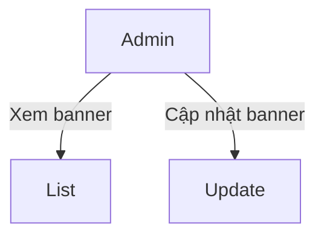
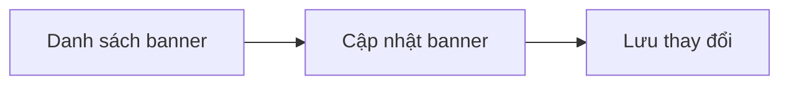
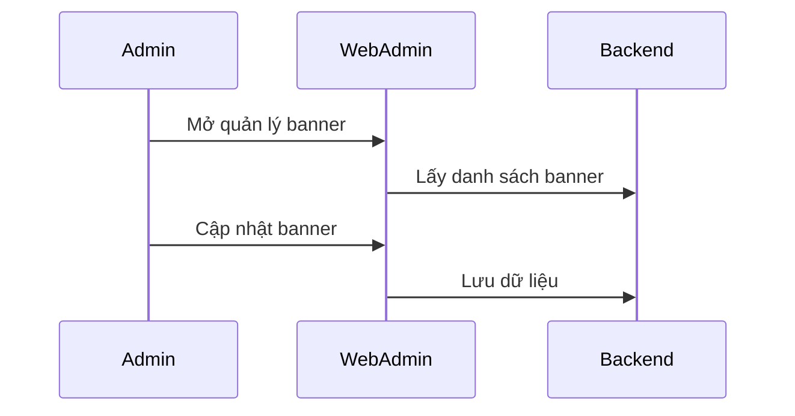
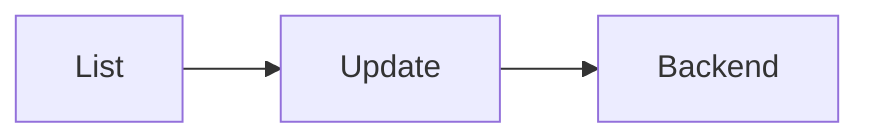

# Module: Quản lý banner

## Nội dung chính
Module Quản lý banner quản lý danh sách banner trên bốn nền tảng khác nhau và cung cấp chức năng cập nhật nội dung banner.

## Page liên quan
- Page 4: Quản lý banner cho 4 nền tảng.
- Page 5: Màn hình cập nhật banner.

## Image Analysis (auto-generated)

- Page 4:
  - 4.1.png
- Page 5:
  - 5.1.png

> Note: review each image and fill UI Elements / Visual cues accordingly.

## Requirement được phát hiện
| ID | Requirement | Loại | Actor liên quan | Mức độ rõ ràng |
|---|---|---|---|---|
| REQ-BN-001 | Hiển thị danh sách banner theo 4 nền tảng. | Functional | Admin | Clear |
| REQ-BN-002 | Cho phép cập nhật nội dung banner. | Functional | Admin | Clear |
| REQ-BN-003 | UI phải sử dụng lại cấu trúc hiện có. | Business Rule | Admin/FE | Clear |

## Business Rule
- BR-BN-001: Banner phải liên kết với nền tảng hiển thị cụ thể.
- BR-BN-002: Mọi cập nhật banner cần hiển thị kết quả thành công hoặc lỗi.
- BR-BN-003: Nếu có chức năng xóa, phải xác nhận với popup.

## Dữ liệu liên quan
| Data Object | Field / Attribute | Mô tả | Bắt buộc? | Ghi chú |
|---|---|---|---|---|
| Banner | bannerId | ID banner | Yes | Khoá chính |
| Banner | platform | Nền tảng hiển thị | Yes | 4 nền tảng |
| Banner | imageUrl | URL ảnh banner | Yes | |
| Banner | title | Tiêu đề banner | No | |
| Banner | link | Link banner | No | |
| Banner | status | Trạng thái hiển thị | No | |

## Actor / Role liên quan
- Actor: Admin Web Admin
- Vai trò: Quản lý nội dung banner.
- Quyền/hành động:
  - Xem danh sách banner.
  - Chọn và cập nhật banner.
  - Lưu thay đổi banner.

## Assumption
- Không có yêu cầu tạo mới hoặc xóa banner rõ ràng.
- Banner chỉ hiển thị trên 4 nền tảng cố định.
- UI cập nhật banner tái sử dụng từ hệ thống cũ.

## Open Questions
- 4 nền tảng là những nền tảng nào?
- Có cần hỗ trợ nhiều kích thước ảnh banner không?
- Có cần lên lịch hiển thị banner không?
- Có cần bật/tắt từng banner không?

## Mermaid diagrams
### Use Case Diagram

### Business Flow Diagram

### Sequence Diagram

### Module Dependency Diagram

## Gap Analysis
- Chưa rõ 4 nền tảng cụ thể.
- Chưa biết có cần chức năng tạo/xóa banner.

## Đề xuất kiến trúc sơ bộ
- Frontend: bảng banner, form cập nhật, xác nhận lưu.
- Backend: API lấy banner, API cập nhật banner.
- Data: bảng `banners`.

## Hidden requirements & Edge cases
- Image upload: phải hỗ trợ nhiều kích thước, `max file size` và `aspect ratio` rõ ràng; validate trước khi upload.
- Preview cho 4 platforms: cần responsive preview/placeholder cho từng platform (desktop/mobile/tablet) và khả năng switch preview.
- Atomic update: đảm bảo rollback/transactional behavior nếu phần upload hoặc update fail để tránh inconsistent state.

## Implementation breakdown (frontend tasks)
- [UI][Small] `BannerList` component với platform filter. Est: 1.5–2.5d
- [UI][Small] `BannerEditForm` gồm image uploader và platform preview. Est: 2–3d

<!-- Note: Integration, testing, and accessibility tasks intentionally excluded from this breakdown per request. -->

## FE Estimate (single senior FE)
- Sum (mid ranges): 4.5d
- Contingency 20%: 0.9d
- Total FE estimate: ~5.4d

