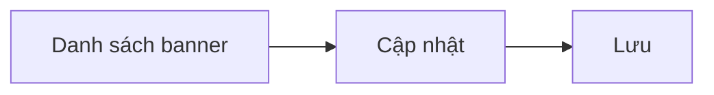

# Module: Quản lý Banner

| Trường | Giá trị |
|--------|---------|
| **Pages** | 4–5 |
| **Ước lượng FE** | ~5,4 ngày |
| **User Story** | QLB_US1 – QLB_US3 |

## Tổng quan

Quản lý banner hiển thị trên **4 nền tảng** `[ĐÃ XÁC NHẬN]` và cập nhật nội dung banner.

## Page liên quan

| Page | Nội dung |
|------|----------|
| 4 | Danh sách banner theo nền tảng |
| 5 | Màn hình cập nhật banner |

## Yêu cầu chức năng

| ID | Mô tả | Loại | Mức độ |
|---|---|---|---|
| REQ-BN-001 | Hiển thị danh sách banner theo 4 nền tảng | Chức năng | Rõ |
| REQ-BN-002 | Cập nhật nội dung banner | Chức năng | Rõ |
| REQ-BN-003 | Tái sử dụng cấu trúc UI hiện có | Quy tắc | Rõ |

## Quy tắc nghiệp vụ

- BR-BN-001 `[GIẢ ĐỊNH]`: Banner liên kết với nền tảng hiển thị cụ thể.
- BR-BN-002: Hiển thị kết quả thành công hoặc lỗi sau khi cập nhật.
- BR-BN-003 `[ĐÃ XÁC NHẬN]`: Nếu có xóa, phải popup xác nhận.

## Dữ liệu liên quan `[GIẢ ĐỊNH]`

| Đối tượng | Trường | Mô tả | Bắt buộc |
|---|---|---|---|
| Banner | bannerId | ID banner | Có |
| Banner | platform | Nền tảng hiển thị | Có |
| Banner | imageUrl | URL ảnh | Có |
| Banner | title | Tiêu đề | Không |
| Banner | link | Link đích | Không |
| Banner | status | Trạng thái hiển thị | Không |

## Vai trò sử dụng

- **Người dùng:** Admin Web Admin
- **Thao tác:** Xem danh sách, chọn và cập nhật banner

## Giả định

- Chưa thấy yêu cầu tạo mới hoặc xóa banner trên UI.
- 4 nền tảng là cố định.
- Form cập nhật tái sử dụng từ hệ thống cũ.

## Câu hỏi cần khách xác nhận

1. 4 nền tảng cụ thể là gì?
2. Kích thước và định dạng ảnh banner?
3. Có cần lên lịch hiển thị banner không?
4. Có cần bật/tắt từng banner không?

## Luồng nghiệp vụ

## Phân tích khoảng trống

- Chưa rõ tên 4 nền tảng.
- Chưa xác định có chức năng tạo/xóa banner.

## Hạng mục triển khai (giao diện)

| Hạng mục | Quy mô | Ước lượng |
|----------|--------|-----------|
| Danh sách banner + lọc nền tảng | S | 1,5–2,5 ngày |
| Form chỉnh sửa + upload ảnh + preview | S | 2–3 ngày |

## Yêu cầu bổ sung & ngoài phạm vi

- `[GIẢ ĐỊNH]` Kiểm tra file ảnh trước upload, preview theo nền tảng.
- `[NGOÀI PHẠM VI]` Lên lịch hiển thị — xem [README.md](../README.md).

## Ước lượng FE (1 Senior)

| Hạng mục | Ngày |
|----------|------|
| Tổng (mid) | 4,5 |
| Dự phòng 20% | 0,9 |
| **Tổng cộng** | **~5,4** |

## User Story

| ID | Tên | Điểm |
|----|-----|------|
| QLB_US1 | Danh sách banner theo nền tảng | S |
| QLB_US2 | Chỉnh sửa nội dung banner | M |
| QLB_US3 | Kiểm tra file ảnh trước khi lưu | S |
