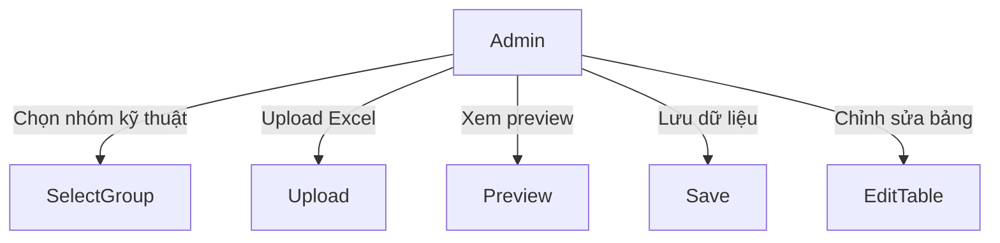
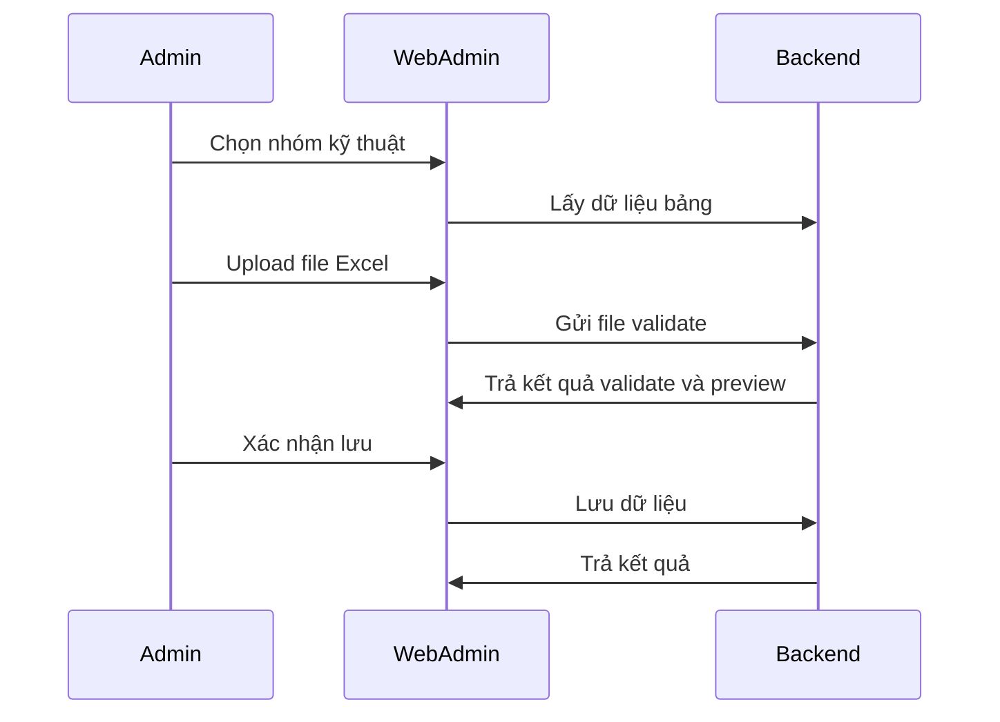

# Module: Quản lý danh mục kỹ thuật hệ thống

## Nội dung chính
Module Quản lý danh mục kỹ thuật hệ thống xử lý luồng từ chọn nhóm kỹ thuật, upload file Excel, validate, preview dữ liệu, lưu cập nhật và chỉnh sửa dữ liệu trên bảng quản lý chính.

## Page liên quan
- Page 38: Tổng quan luồng danh mục kỹ thuật hệ thống.
- Page 39: Bảng chi tiết full của dữ liệu nhóm kỹ thuật.
- Page 40: Side panel upload file và confirm khi tắt.
- Page 41: Bảng chi tiết side panel với tooltip lỗi.
- Page 42: Chỉnh sửa danh mục kỹ thuật bảng chính.
- Page 43: Action và modal cho bảng quản lý chính.

## Image Analysis (auto-generated)

- Page 38:
  - 38.1.png
  - 38.2.png
- Page 39:
  - 39.1.png
- Page 40:
  - 40.1.png
  - 40.2.png
  - 40.3.png
- Page 41:
  - 41.1.png
- Page 42:
  - 42.1.png
- Page 43:
  - 43.1.png

> Note: review each image and fill UI Elements / Visual cues accordingly.
## Requirement được phát hiện
| ID | Requirement | Loại | Actor liên quan | Mức độ rõ ràng |
|---|---|---|---|---|
| REQ-DMKT-001 | Cho phép chọn nhóm kỹ thuật và hiển thị dữ liệu tương ứng. | Functional | Admin | Clear |
| REQ-DMKT-002 | Upload file Excel để cập nhật danh mục kỹ thuật. | Functional | Admin | Clear |
| REQ-DMKT-003 | Validate file trước khi preview. | Functional | Admin | Clear |
| REQ-DMKT-004 | Khi tắt side panel upload, hiển thị popup confirm. | Business Rule | Admin | Clear |
| REQ-DMKT-005 | Tooltip lỗi hiển thị lý do khi hover dòng lỗi. | Functional | Admin | Clear |
| REQ-DMKT-006 | Lưu cập nhật phải refresh bảng chính. | Functional | Admin | Clear |
| REQ-DMKT-007 | Chỉnh sửa danh mục kỹ thuật trên bảng quản lý chính. | Functional | Admin | Clear |
| REQ-DMKT-008 | Action và modal cho bảng chính phải tồn tại. | Functional | Admin | Clear |
| REQ-DMKT-009 | Chỉ DMKT đánh dấu "Nhóm thêm nhanh" mới xuất hiện trong chức năng thêm nhanh trên Web Chuyên gia. | Business Rule | Admin | Clear |

## Business Rule
- BR-DMKT-001: Dropdown nhóm kỹ thuật là nguồn dữ liệu duy nhất của page.
- BR-DMKT-002: Bảng chính hiển thị dữ liệu của nhóm kỹ thuật được chọn.
- BR-DMKT-003: Upload chỉ được preview khi validate thành công.
- BR-DMKT-004: Tắt side panel upload phải hiển thị popup confirm.
- BR-DMKT-005: Tooltip lỗi phải hiển thị lý do lỗi khi hover.
- BR-DMKT-006: Chỉ DMKT được tick "Nhóm thêm nhanh" mới xuất hiện khi thêm nhanh trên Web Chuyên gia.

## Dữ liệu liên quan
| Data Object | Field / Attribute | Mô tả | Bắt buộc? | Ghi chú |
|---|---|---|---|---|
| TechnicalCategory | categoryId | ID danh mục kỹ thuật | Yes | |
| TechnicalCategory | groupId | Nhóm kỹ thuật | Yes | |
| TechnicalCategory | name | Tên danh mục kỹ thuật | Yes | |
| TechnicalCategory | quickAddFlag | Nhóm thêm nhanh | No | Checkbox hiển thị trên Web Chuyên gia |
| ExcelUpload | fileName | Tên file upload | Yes | |
| ExcelUpload | validationStatus | Trạng thái validate | Yes | |
| ExcelUpload | previewRows | Dữ liệu preview | No | |
| ValidationError | row | Dòng lỗi | Yes | |
| ValidationError | message | Lý do lỗi | Yes | |

## Actor / Role liên quan
- Actor: Admin Web Admin
- Vai trò: Quản lý danh mục kỹ thuật hệ thống.
- Quyền/hành động:
  - Chọn nhóm kỹ thuật.
  - Upload file Excel.
  - Xem preview dữ liệu.
  - Lưu dữ liệu.
  - Chỉnh sửa bảng chính.

## Assumption
- File upload dùng định dạng Excel chuẩn.
- Upload không lưu nếu validate chưa thành công.
- Preview side panel là bước bắt buộc.
- Bảng chính có thể chỉnh sửa bổ sung sau khi lưu.

## Open Questions
- Định dạng Excel cụ thể là gì?
- Upload có ghi đè toàn bộ dữ liệu hay cập nhật từng dòng?
- Có cần rollback khi lưu thất bại không?
- Trường nào được phép chỉnh sửa trên bảng chính?

## Mermaid diagrams
### Use Case Diagram


### Business Flow Diagram


### Sequence Diagram


### Module Dependency Diagram


## Gap Analysis
- Chưa rõ định dạng Excel và cấu trúc trường dữ liệu.
- Chưa xác định ghi đè hay merge khi lưu.
- Chưa có yêu cầu rollback hoặc lịch sử thay đổi.

## Đề xuất kiến trúc sơ bộ
- Frontend: dropdown nhóm kỹ thuật, bảng dữ liệu, upload file, preview, modal confirm, bảng chỉnh sửa.
- Backend: API lấy dữ liệu theo nhóm kỹ thuật, API validate upload, API lưu dữ liệu, API chỉnh sửa bảng.
- Data: bảng `technical_categories`, bảng `technical_category_groups`, bảng `excel_uploads`, bảng `validation_errors`.

## Hidden requirements & Edge cases
- Excel template: cần xác nhận exact columns và `validation rules` (type, format, required fields) trước khi triển khai.
- Large uploads: backend có thể xử lý streaming/async validation; frontend phải hiển thị upload `progress` và xử lý partial results.
- Merge vs overwrite: cần quyết định semantic khi lưu previewed data (overwrite toàn bộ hay upsert/mapping theo key).
- Error reporting: ánh xạ lỗi validate theo dòng (row) để UI hiển thị Retry/Ignore/Skip từng row rõ ràng.
- Concurrency: xử lý trường hợp người dùng khác chỉnh sửa bảng chính trong khi upload/preview đang progress.

## Implementation breakdown (frontend tasks)
- [UI][Medium] `GroupSelector` + `TechnicalCategoryTable` với inline edit. Est: 2–3d
- [Feature][Large] `ExcelUploader` with client-side pre-checks, upload progress, and server validation handling. Est: 4–6d
- [UI][Medium] `UploadPreviewPanel` hiển thị validated rows, error tooltips và selective apply. Est: 2–3d

<!-- Note: Integration, testing, and accessibility tasks intentionally excluded from this breakdown per request. -->

## FE Estimate (single senior FE)
- Sum (mid ranges): 10d
- Contingency 20%: 2d
- Total FE estimate: ~12d

```
