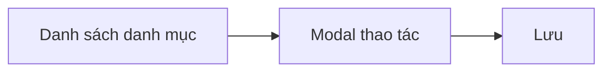

# Module: Quản lý Danh mục

| Trường | Giá trị |
|--------|---------|
| **Pages** | 34–35 |
| **Ước lượng FE** | ~4,5 ngày |
| **User Story** | QLDM_US1 – QLDM_US3 |

## Tổng quan

Quản lý danh mục lớn: bảng danh sách và modal thao tác (thêm/sửa). Tái sử dụng UI hiện có `[ĐÃ XÁC NHẬN]`.

## Page liên quan

| Page | Nội dung |
|------|----------|
| 34 | Bảng quản lý danh mục lớn |
| 35 | Thao tác và modal quản lý danh mục |

## Yêu cầu chức năng

| ID | Mô tả | Loại | Mức độ |
|---|---|---|---|
| REQ-CAT-001 | Hiển thị bảng quản lý danh mục lớn | Chức năng | Rõ |
| REQ-CAT-002 | Thao tác và modal quản lý danh mục | Chức năng | Rõ |
| REQ-CAT-003 | Tái sử dụng cấu trúc UI hiện có | Quy tắc | Rõ |

## Quy tắc nghiệp vụ

- BR-CAT-001: Thao tác danh mục mở qua modal.
- BR-CAT-002: Dữ liệu hiển thị đầy đủ trên bảng.
- BR-CAT-003: Modal hỗ trợ sửa và xác nhận hành động.

## Dữ liệu liên quan `[GIẢ ĐỊNH]`

| Đối tượng | Trường | Mô tả | Bắt buộc |
|---|---|---|---|
| Category | categoryId | ID danh mục | Có |
| Category | name | Tên danh mục | Có |
| Category | description | Mô tả | Không |
| Category | status | Trạng thái | Không |

## Vai trò sử dụng

- **Người dùng:** Admin Web Admin
- **Thao tác:** Xem danh sách, mở modal, lưu/cập nhật danh mục

## Giả định

- Danh mục cấu trúc phẳng (một cấp).
- Modal tái sử dụng component CRUD hiện có.

## Câu hỏi cần khách xác nhận

1. Có cần tạo mới và xóa danh mục không?
2. Danh mục có nhiều cấp hay chỉ một cấp?
3. Có phân quyền theo danh mục không?

## Luồng nghiệp vụ

## Phân tích khoảng trống

- Chưa rõ có tạo mới/xóa hay không.
- Chưa xác định cấu trúc phân cấp.

## Hạng mục triển khai (giao diện)

| Hạng mục | Quy mô | Ước lượng |
|----------|--------|-----------|
| Bảng danh mục + cột thao tác | S | 1,5–2,5 ngày |
| Modal thêm/sửa + validation | S | 1,5–2 ngày |

## Yêu cầu bổ sung & ngoài phạm vi

- `[GIẢ ĐỊNH]` Kiểm tra tên trùng lặp.
- `[NGOÀI PHẠM VI]` Cây nhiều cấp, import/export — xem [README.md](../README.md).

## Ước lượng FE (1 Senior)

| Hạng mục | Ngày |
|----------|------|
| Tổng (mid) | 3,75 |
| Dự phòng 20% | 0,75 |
| **Tổng cộng** | **~4,5** |

## User Story

| ID | Tên | Điểm |
|----|-----|------|
| QLDM_US1 | Danh sách danh mục lớn | S |
| QLDM_US2 | Chỉnh sửa danh mục (modal) | M |
| QLDM_US3 | Thêm danh mục mới | M |

> Module **Quản lý Nhóm kỹ thuật** tái sử dụng template UI từ module này.
