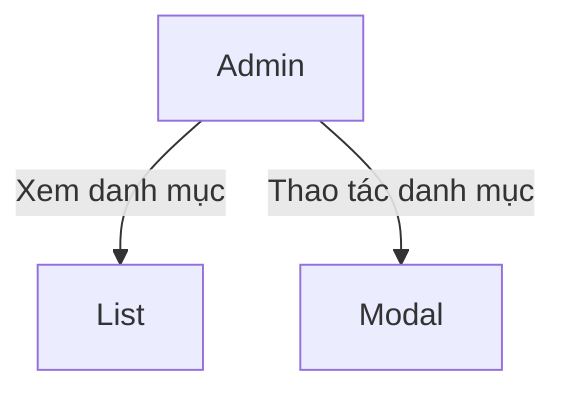
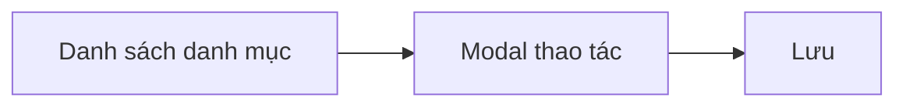
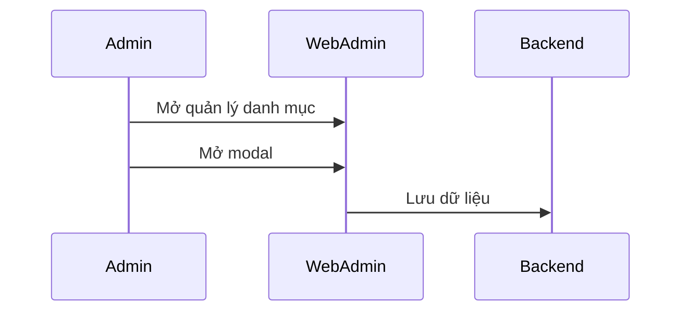
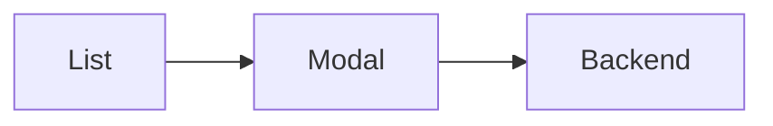

# Module: Quản lý danh mục

## Nội dung chính
Module Quản lý danh mục hiển thị quản lý danh mục lớn và modal thao tác chỉnh sửa. Page 34-35 mô tả bảng danh mục lớn và các action/modal tương ứng.

## Page liên quan
- Page 34: Quản lý danh mục lớn.
- Page 35: Action và modal quản lý danh mục.

## Requirement được phát hiện
| ID | Requirement | Loại | Actor liên quan | Mức độ rõ ràng |
|---|---|---|---|---|
| REQ-CAT-001 | Hiển thị bảng quản lý danh mục lớn. | Functional | Admin | Clear |
| REQ-CAT-002 | Cung cấp action và modal thao tác danh mục. | Functional | Admin | Clear |
| REQ-CAT-003 | UI phải tái sử dụng cấu trúc hiện có. | Business Rule | Admin/FE | Clear |

## Business Rule
- BR-CAT-001: Action danh mục phải mở modal thao tác.
- BR-CAT-002: Dữ liệu danh mục phải hiển thị đầy đủ trên bảng.
- BR-CAT-003: Modal phải hỗ trợ sửa và xác nhận hành động.

## Dữ liệu liên quan
| Data Object | Field / Attribute | Mô tả | Bắt buộc? | Ghi chú |
|---|---|---|---|---|
| Category | categoryId | ID danh mục | Yes | |
| Category | name | Tên danh mục | Yes | |
| Category | description | Mô tả | No | |
| Category | status | Trạng thái | No | |

## Actor / Role liên quan
- Actor: Admin Web Admin
- Vai trò: Quản lý danh mục.
- Quyền/hành động:
  - Xem danh sách danh mục.
  - Mở modal thao tác.
  - Lưu/cập nhật danh mục.

## Assumption
- Danh mục có cấu trúc phẳng.
- Modal sử dụng lại component CRUD hiện có.
- Không cần cây phân cấp phức tạp.

## Open Questions
- Có cần chức năng tạo mới và xóa danh mục không?
- Danh mục có nhiều cấp hay chỉ một cấp?
- Có cần phân quyền truy cập theo danh mục không?

## Mermaid diagrams
### Use Case Diagram


### Business Flow Diagram


### Sequence Diagram


### Module Dependency Diagram


## Gap Analysis
- Chưa rõ có tạo mới/xóa hay không.
- Chưa xác định cấu trúc dữ liệu phức tạp.

## Đề xuất kiến trúc sơ bộ
- Frontend: bảng danh mục, modal CRUD.
- Backend: API lấy danh mục, API lưu danh mục.
- Data: bảng `categories`.

## Hidden requirements & Edge cases
- Category hierarchy: nếu cần multi-level later, UI phải support tree structure hoặc expandable lists.
- Validation: tránh duplicate names, áp dụng trimming/normalization và quy định unique key.
- Bulk import/export: có thể yêu cầu import/export CSV/Excel — chuẩn bị interface để extend.

## Implementation breakdown (frontend tasks)
- [UI][Small] `CategoryList` table với CRUD action column. Est: 1.5–2.5d
- [UI][Small] `CategoryModal` cho create/edit với validation. Est: 1.5–2d

<!-- Note: Integration, testing, and accessibility tasks intentionally excluded from this breakdown per request. -->

## FE Estimate (single senior FE)
- Sum (mid ranges): 3.75d
- Contingency 20%: 0.75d
- Total FE estimate: ~4.5d

```
