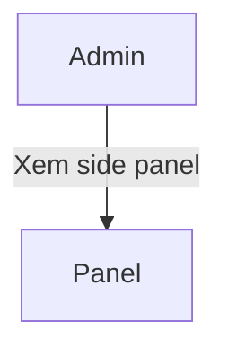
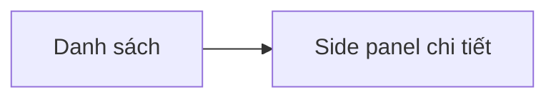
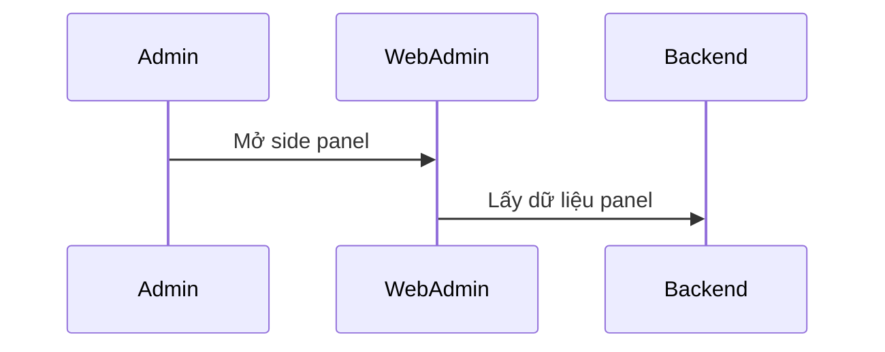
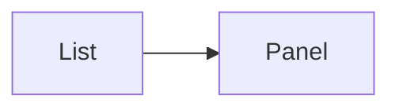

# Module: Quản lý loại hình / danh mục dịch vụ

## Nội dung chính
Module trình bày side panel read-only cho nhiều loại đối tượng dịch vụ và danh mục hỗ trợ quản lý tài khoản. Page 10-19 mô tả layout hiển thị từng loại dữ liệu: Bảo mật, Tài khoản, Tư vấn online, Chăm sóc tại nhà, Phòng mạch, Cơ sở y khoa, Trung tâm xét nghiệm, Nhà thuốc, Cửa hàng, Danh sách gói dịch vụ và Chi tiết gói dịch vụ.

## Page liên quan
- Page 10: Side panel Bảo mật.
- Page 11: Side panel Tài khoản.
- Page 12: Side panel Tư vấn online.
- Page 13: Side panel Chăm sóc tại nhà.
- Page 14: Side panel Phòng mạch.
- Page 15: Side panel Cơ sở y khoa.
- Page 16: Side panel Trung tâm xét nghiệm.
- Page 17: Side panel Nhà thuốc.
- Page 18: Side panel Cửa hàng.
- Page 19: Side panel Danh sách gói dịch vụ / Chi tiết gói dịch vụ.

## Image Analysis (auto-generated)

- Page 10:
  - 10.1.png
- Page 11:
  - 11.1.png
- Page 12:
  - 12.1.png
- Page 13:
  - 13.1.png
- Page 14:
  - 14.1.png
- Page 15:
  - 15.1.png
- Page 16:
  - 16.1.png
- Page 17:
  - 17.1.png
- Page 18:
  - 18.1.png
- Page 19:
  - 19.1.png

> Note: review each image and fill UI Elements / Visual cues accordingly.


## Requirement được phát hiện
| ID | Requirement | Loại | Actor liên quan | Mức độ rõ ràng |
|---|---|---|---|---|
| REQ-SV-001 | Tái sử dụng side panel chi tiết đã có sẵn từ Web Chuyên Gia trong Web Admin. | Functional | Admin | Clear |
| REQ-SV-002 | Side panel được hiển thị ở chế độ read-only, không cho phép sửa trường dữ liệu. | Functional | Admin | Clear |
| REQ-SV-003 | Ẩn tất cả button thao tác không cần thiết trong Web Admin. | Business Rule | Admin | Clear |
| REQ-SV-004 | Ẩn các section không cần thiết trong tab Bảo mật. | Business Rule | Admin | Clear |
| REQ-SV-005 | Bỏ icon xóa trên ảnh hiển thị trong side panel. | Business Rule | Admin | Clear |
| REQ-SV-006 | Mỗi loại panel chỉ hiển thị nội dung phù hợp với loại đối tượng (không thêm chức năng edit). | Functional | Admin | Clear |

## Business Rule
- BR-SV-001: Side panel phải reuse UI từ Web Chuyên Gia và được chuyển sang chế độ read-only.
- BR-SV-002: Không hiển thị button action trên side panel khi dùng ở Web Admin.
- BR-SV-003: Ẩn các section không cần thiết trong tab Bảo mật so với bản Web Chuyên Gia.
- BR-SV-004: Bỏ icon xóa trên tất cả ảnh hiển thị trong side panel.
- BR-SV-005: Các field phải hiển thị dưới dạng read-only control / plain text, không cho phép chỉnh sửa.
- BR-SV-006: Nếu panel gốc có dropdown hoặc toggle edit, hiển thị giá trị hiện tại nhưng không mở menu hoặc thay đổi trạng thái.

## Dữ liệu liên quan
| Data Object | Field / Attribute | Mô tả | Bắt buộc? | Ghi chú |
|---|---|---|---|---|
| DetailPanel | panelType | Loại panel | Yes | |
| DetailPanel | fields | Danh sách trường hiển thị | Yes | |
| ServiceCategory | categoryId | ID loại hình/danh mục | Yes | |
| ServiceCategory | name | Tên loại hình/danh mục | Yes | |
| ServiceCategory | details | Chi tiết hiển thị | No | |

## Actor / Role liên quan
- Actor: Admin Web Admin
- Vai trò: Xem chi tiết các loại dịch vụ/danh mục.
- Quyền/hành động:
  - Mở side panel.
  - Xem dữ liệu read-only.

## Assumption
- Các side panel đã có sẵn và chỉ cần tái sử dụng.
- Admin không thể chỉnh sửa nội dung trong side panel.
- Panel được cấu hình theo `panelType`.

## Open Questions
- Có cần phân biệt panel cho các cấp người dùng khác nhau không?
- Các trường nào cần hiển thị trên mỗi panel?
- Có cần mở rộng thêm loại panel trong tương lai không?

## Mermaid diagrams
### Use Case Diagram


### Business Flow Diagram


### Sequence Diagram


### Module Dependency Diagram


## Gap Analysis
- Chưa rõ ràng mối liên hệ giữa module này và các module khác.
- Chưa xác định chi tiết trường dữ liệu hiển thị.

## Đề xuất kiến trúc sơ bộ
- Frontend: component side panel chung theo `panelType`.
- Backend: API lấy dữ liệu chi tiết panel.
- Data: cấu trúc linh hoạt cho `detail_panel`.

## Hidden requirements & Edge cases
- Có nhiều `panelType` khác nhau — chuẩn bị fallback template cho `unknown panelType`.
- Nội dung dài: hỗ trợ collapsing sections và copy-to-clipboard cho các ID hoặc mã lớn.
- Images/media trong panel cần `lazy loading` và placeholder để tránh layout shift.
- Nếu Web Chuyên Gia panel có edit controls, ở Web Admin phải render dưới dạng static/read-only view.
- Tab Bảo mật có thể chứa sections chỉ dành cho người dùng — Web Admin chỉ giữ phần cần để review.

## Implementation breakdown (frontend tasks)
- [UI][Small] `GenericDetailPanel` component với `panelType` renderer mapping. Est: 1.5–2.5d
- [UI][Small] `ReadOnlyField` wrapper để convert edit controls thành display-only. Est: 1–1.5d
- [UI][Small] `SecurityTabView` read-only variant ẩn các section không cần thiết. Est: 1.5–2d
- [UI][Small] `ImagePreview` view-only component (no delete icon). Est: 1–1.5d

<!-- Note: Integration, testing, and accessibility tasks intentionally excluded from this breakdown per request. -->

## FE Estimate (single senior FE)
- Sum (mid ranges): 6.25d
- Contingency 20%: 1.25d
- Total FE estimate: ~7.5d

```
