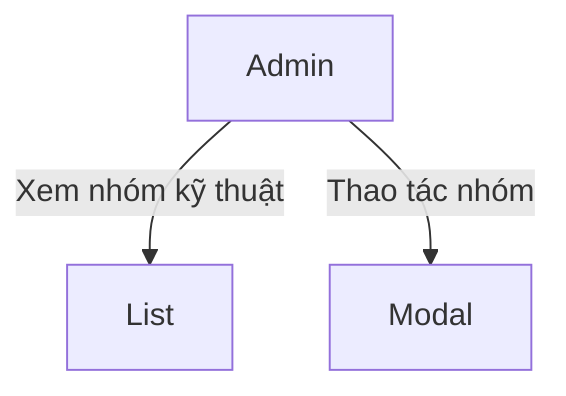
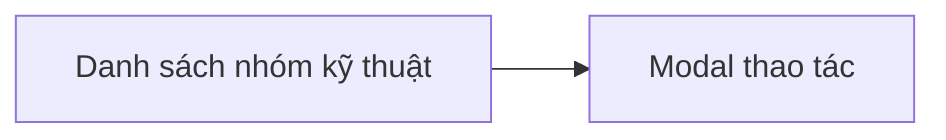
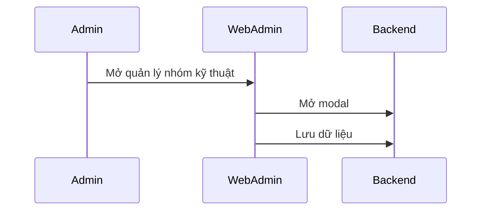

# Module: Quản lý nhóm kỹ thuật

## Nội dung chính
Module Quản lý nhóm kỹ thuật tái sử dụng UI và modal của Quản lý danh mục. Page 36-37 mô tả bảng và hành động modal tương tự module danh mục.

## Page liên quan
- Page 36: Bảng quản lý nhóm kỹ thuật.
- Page 37: Action và modal cho nhóm kỹ thuật.

## Image Analysis (auto-generated)

- Page 36:
  - 36.1.png
- Page 37:
  - 37.1.png

> Note: review each image and fill UI Elements / Visual cues accordingly.


## Requirement được phát hiện
| ID | Requirement | Loại | Actor liên quan | Mức độ rõ ràng |
|---|---|---|---|---|
| REQ-TG-001 | Hiển thị bảng quản lý nhóm kỹ thuật. | Functional | Admin | Clear |
| REQ-TG-002 | Cho phép thao tác nhóm kỹ thuật bằng modal. | Functional | Admin | Clear |
| REQ-TG-003 | UI phải tái sử dụng cấu trúc quản lý danh mục. | Business Rule | Admin/FE | Clear |

## Business Rule
- BR-TG-001: Nhóm kỹ thuật sử dụng UI và modal tương tự quản lý danh mục.
- BR-TG-002: Action phải mở modal xác nhận hoặc chỉnh sửa.
- BR-TG-003: Dữ liệu nhóm kỹ thuật phải hiển thị rõ ràng.

## Dữ liệu liên quan
| Data Object | Field / Attribute | Mô tả | Bắt buộc? | Ghi chú |
|---|---|---|---|---|
| TechnicalGroup | groupId | ID nhóm kỹ thuật | Yes | |
| TechnicalGroup | name | Tên nhóm kỹ thuật | Yes | |
| TechnicalGroup | description | Mô tả nhóm | No | |
| TechnicalGroup | isActive | Trạng thái hoạt động | No | |

## Actor / Role liên quan
- Actor: Admin Web Admin
- Vai trò: Quản lý nhóm kỹ thuật.
- Quyền/hành động:
  - Xem danh sách nhóm.
  - Mở modal thao tác.
  - Lưu/cập nhật nhóm kỹ thuật.

## Assumption
- Nhóm kỹ thuật là cấu hình bổ sung cho danh mục kỹ thuật.
- Modal và bảng dùng chung template UI.

## Open Questions
- Nhóm kỹ thuật có liên kết danh mục kỹ thuật khác không?
- Có cần phân quyền riêng cho nhóm kỹ thuật không?
- Có cần chức năng thêm nhanh hay chỉ CRUD đơn giản?

## Mermaid diagrams
### Use Case Diagram


### Business Flow Diagram


### Sequence Diagram


### Module Dependency Diagram


## Gap Analysis
- Chưa rõ mối quan hệ nhóm kỹ thuật và danh mục kỹ thuật.
- Chưa xác định phạm vi CRUD đầy đủ.

## Đề xuất kiến trúc sơ bộ
- Frontend: bảng nhóm kỹ thuật, modal thao tác.
- Backend: API nhóm kỹ thuật.
- Data: bảng `technical_groups`.

## Hidden requirements & Edge cases
- Mối quan hệ với categories: nhóm có thể cần tham chiếu `category IDs` — cần làm rõ data model.
- Bulk operations/import: có thể cần import nhóm hoặc bulk edit; UI/UX phải hỗ trợ thao tác hàng loạt.

## Implementation breakdown (frontend tasks)
- [UI][Small] `TechnicalGroupList` table và action column. Est: 1.5–2d
- [UI][Small] `TechnicalGroupModal` cho create/edit. Est: 1–1.5d

<!-- Note: Integration, testing, and accessibility tasks intentionally excluded from this breakdown per request. -->

## FE Estimate (single senior FE)
- Sum (mid ranges): 3d
- Contingency 20%: 0.6d
- Total FE estimate: ~3.6d

```
