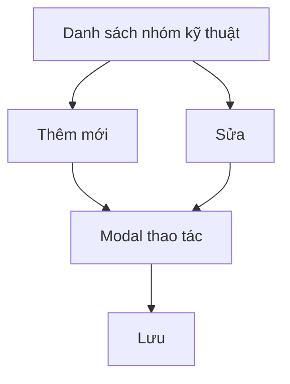
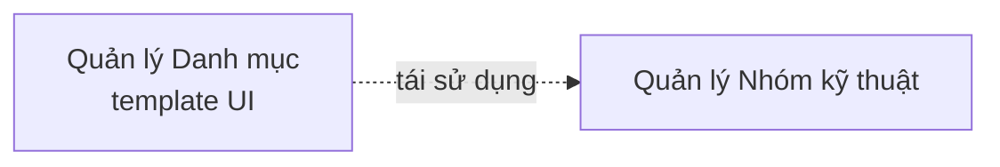

# Module: Quản lý Nhóm kỹ thuật

| Trường | Giá trị |
|--------|---------|
| **Pages** | 36–37 |
| **Ước lượng FE** | ~2,5 ngày |
| **User Story** | QLNKTT_US1 – QLNKTT_US2 |
| **Phụ thuộc** | [Quản lý Danh mục](quan-ly-danh-muc.md) — tái sử dụng template UI |

## Tổng quan

Quản lý nhóm kỹ thuật với giao diện và modal tương tự Quản lý Danh mục `[ĐÃ XÁC NHẬN]`. Estimate giảm ~40% nhờ reuse.

## Page liên quan

| Page | Nội dung |
|------|----------|
| 36 | Bảng quản lý nhóm kỹ thuật |
| 37 | Thao tác và modal nhóm kỹ thuật |

## Yêu cầu chức năng

| ID | Mô tả | Loại | Mức độ |
|---|---|---|---|
| REQ-TG-001 | Hiển thị bảng quản lý nhóm kỹ thuật | Chức năng | Rõ |
| REQ-TG-002 | Thao tác nhóm kỹ thuật qua modal | Chức năng | Rõ |
| REQ-TG-003 | Tái sử dụng UI Quản lý Danh mục | Quy tắc | Rõ |

## Quy tắc nghiệp vụ

- BR-TG-001 `[ĐÃ XÁC NHẬN]`: UI và modal tương tự Quản lý Danh mục.
- BR-TG-002: Thao tác mở qua modal xác nhận hoặc chỉnh sửa.
- BR-TG-003: Dữ liệu nhóm hiển thị rõ ràng trên bảng.

## Dữ liệu liên quan `[GIẢ ĐỊNH]`

| Đối tượng | Trường | Mô tả | Bắt buộc |
|---|---|---|---|
| TechnicalGroup | groupId | ID nhóm | Có |
| TechnicalGroup | name | Tên nhóm | Có |
| TechnicalGroup | description | Mô tả | Không |
| TechnicalGroup | isActive | Trạng thái hoạt động | Không |

## Vai trò sử dụng

- **Người dùng:** Admin Web Admin
- **Thao tác:** Xem danh sách, mở modal, lưu/cập nhật nhóm

## Giả định

- Nhóm kỹ thuật là cấu hình bổ sung cho DMKT.
- Bảng và modal dùng chung template với Quản lý Danh mục.

## Câu hỏi cần khách xác nhận

1. Nhóm kỹ thuật liên kết với danh mục kỹ thuật như thế nào?
2. Có cần phân quyền riêng cho nhóm kỹ thuật không?

## Luồng nghiệp vụ

## Phụ thuộc UI

## Phân tích khoảng trống

- Chưa rõ mối quan hệ nhóm kỹ thuật và DMKT.
- Chưa xác định phạm vi CRUD đầy đủ.

## Hạng mục triển khai (giao diện)

| Hạng mục | Quy mô | Ước lượng |
|----------|--------|-----------|
| Bảng nhóm kỹ thuật (clone từ Danh mục) | S | 1–1,5 ngày |
| Modal thêm/sửa (clone từ Danh mục) | S | 0,5–1 ngày |

## Yêu cầu bổ sung & ngoài phạm vi

- `[NGOÀI PHẠM VI]` Import nhóm, thao tác hàng loạt.

## Ước lượng FE (1 Senior)

| Hạng mục | Ngày |
|----------|------|
| Tổng (mid) | 2,1 |
| Dự phòng 20% | 0,4 |
| **Tổng cộng** | **~2,5** |

## User Story

| ID | Tên | Điểm |
|----|-----|------|
| QLNKTT_US1 | Danh sách nhóm kỹ thuật | S |
| QLNKTT_US2 | Tạo / chỉnh sửa nhóm (modal) | M |
