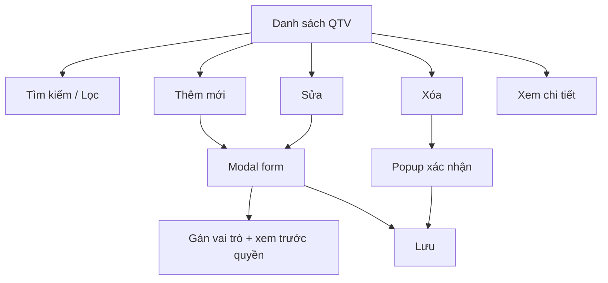

# Module: Quản lý QTV

| Trường | Giá trị |
|--------|---------|
| **Pages** | 1–3 |
| **Ước lượng FE** | ~9,6 ngày |
| **User Story** | QLQTV_US1 – QLQTV_US11 |

## Tổng quan

Quản lý tài khoản quản trị viên (QTV) trên Web Admin: danh sách, chi tiết, thêm/sửa/xóa và phân quyền. Tái sử dụng UI từ Web Chuyên Gia `[ĐÃ XÁC NHẬN]`.

## Page liên quan

| Page | Nội dung |
|------|----------|
| 1 | Màn hình danh sách quản trị viên |
| 2 | Bảng chi tiết đầy đủ, menu thao tác |
| 3 | Thêm/chỉnh sửa quản trị viên và phân quyền |

## Yêu cầu chức năng

| ID | Mô tả | Loại | Mức độ |
|---|---|---|---|
| REQ-QTV-001 | Hiển thị danh sách quản trị viên dạng bảng | Chức năng | Rõ |
| REQ-QTV-002 | Hiển thị bảng chi tiết đầy đủ | Chức năng | Rõ |
| REQ-QTV-003 | Thao tác tùy chọn trên từng dòng | Chức năng | Rõ |
| REQ-QTV-004 | Thêm / chỉnh sửa quản trị viên | Chức năng | Rõ |
| REQ-QTV-005 | Phân quyền quản trị viên | Chức năng | Rõ |
| REQ-QTV-006 | Tái sử dụng UI/table/popup/side panel từ Web Chuyên Gia | Quy tắc | Rõ |
| REQ-QTV-007 | Tìm kiếm và lọc danh sách | Chức năng | `[GIẢ ĐỊNH]` |

## Quy tắc nghiệp vụ

- BR-QTV-001 `[ĐÃ XÁC NHẬN]`: Mọi thao tác xóa phải có popup xác nhận.
- BR-QTV-002 `[ĐÃ XÁC NHẬN]`: Tái sử dụng component sẵn có từ Web Chuyên Gia.
- BR-QTV-003 `[GIẢ ĐỊNH]`: Phân quyền theo role/permission cho từng QTV.

## Dữ liệu liên quan `[GIẢ ĐỊNH]`

| Đối tượng | Trường | Mô tả | Bắt buộc |
|---|---|---|---|
| AdminUser | adminId | ID quản trị viên | Có |
| AdminUser | name | Tên | Có |
| AdminUser | email | Email đăng nhập | Có |
| AdminUser | roles | Danh sách vai trò (role) | Có |
| AdminUser | status | Trạng thái (vd. Active/Disabled) | Có |
| AdminUser | createdAt | Ngày tạo | Không |

## Vai trò sử dụng

- **Người dùng:** Admin Web Admin
- **Thao tác:** Xem danh sách, xem chi tiết, thêm/sửa/xóa, phân quyền

## Giả định

- Danh sách role/permission đã có sẵn trong hệ thống.
- Modal thêm/sửa dùng form chuẩn từ UI hiện có.
- Email cần kiểm tra trùng lặp khi tạo mới.

## Câu hỏi cần khách xác nhận

1. Phân quyền theo role hay permission chi tiết?
2. Trường bắt buộc khi tạo QTV mới?
3. Có cần lịch sử thay đổi quyền không?

## Luồng nghiệp vụ

## Phân tích khoảng trống

- Chưa rõ cấu trúc phân quyền chi tiết.
- Chưa xác định trường bắt buộc khi tạo mới.
- Chưa review ảnh UI để điền cột bảng thực tế.

## Hạng mục triển khai (giao diện)

| Hạng mục | Quy mô | Ước lượng |
|----------|--------|-----------|
| Bảng QTV + phân trang + tìm kiếm/lọc | M | 2–4 ngày |
| Thanh tìm kiếm và bộ lọc | S | 1–1,5 ngày |
| Modal thêm/sửa + chọn role | M | 1,5–2,5 ngày |
| Xem trước quyền theo role | S | 1,5–2 ngày |

## Yêu cầu bổ sung & ngoài phạm vi

- `[GIẢ ĐỊNH]` Kiểm tra email trùng, tìm kiếm có debounce, multi-select role.
- `[NGOÀI PHẠM VI]` Thao tác hàng loạt, audit trail — xem [README.md](../README.md).

## Ước lượng FE (1 Senior)

| Hạng mục | Ngày |
|----------|------|
| Tổng (mid) | 8,0 |
| Dự phòng 20% | 1,6 |
| **Tổng cộng** | **~9,6** |

## User Story

| ID | Tên | Điểm |
|----|-----|------|
| QLQTV_US1 | Danh sách QTV (phân trang) | M |
| QLQTV_US2 | Tìm kiếm theo tên/email | S |
| QLQTV_US3 | Lọc theo trạng thái và vai trò | S |
| QLQTV_US4 | Xem chi tiết QTV | S |
| QLQTV_US5 | Thêm QTV (modal) | M |
| QLQTV_US6 | Sửa QTV (modal) | M |
| QLQTV_US7 | Gán vai trò (multi-select) | S |
| QLQTV_US8 | Xem trước quyền theo vai trò | S |
| QLQTV_US9 | Xác nhận trước khi xóa | S |
| QLQTV_US10 | Trạng thái loading và lỗi | S |
| QLQTV_US11 | Ẩn thao tác theo quyền | M |
