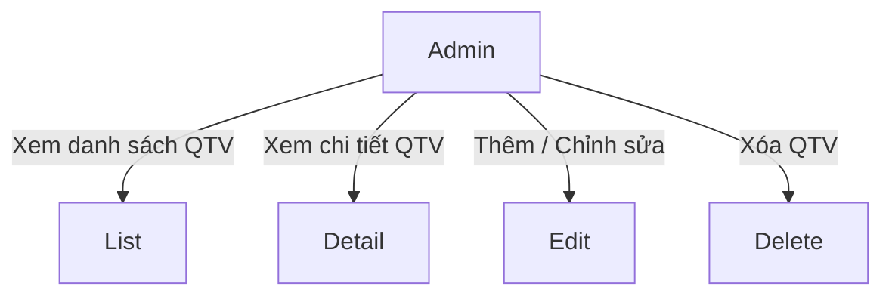
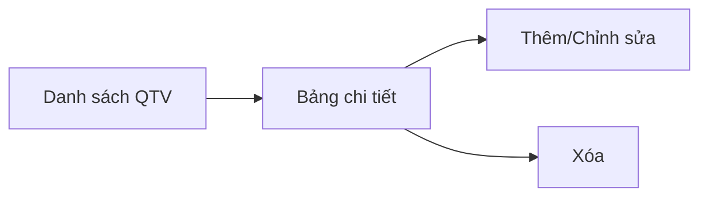
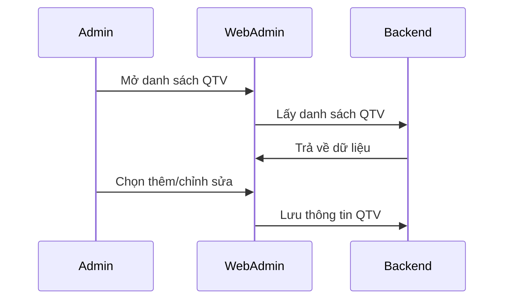
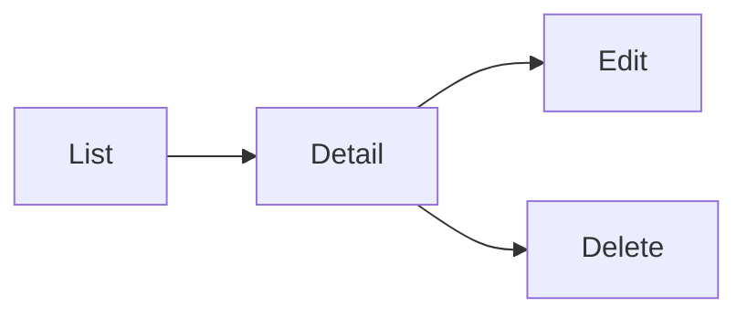

# Module: Quản lý QTV

## Nội dung chính
Module Quản lý QTV bao gồm toàn bộ giao diện quản lý tài khoản quản trị viên trên Web Admin. Nội dung Page 1-3 định nghĩa luồng danh sách QTV, bảng chi tiết, các hành động tùy chọn và chức năng thêm/chỉnh sửa, đồng thời nêu rõ phân quyền cần được cấu hình.

## Page liên quan
- Page 1: Màn hình danh sách quản trị viên với yêu cầu sử dụng lại UI hiện có.
- Page 2: Bảng chi tiết full của quản trị viên.
- Page 3: Chức năng thêm/chỉnh sửa quản trị viên và phân quyền.

## Image Analysis (auto-generated)

- Page 1:
  - 1.1.png
- Page 2:
  - 2.1.png
  - 2.2.png
  - 2.3.png
- Page 3:
  - 3.1.png

> Note: review each image and fill UI Elements / Visual cues accordingly.

## Requirement được phát hiện
| ID | Requirement | Loại | Actor liên quan | Mức độ rõ ràng |
|---|---|---|---|---|
| REQ-QTV-001 | Hiển thị màn hình danh sách quản trị viên dạng bảng. | Functional | Admin | Clear |
| REQ-QTV-002 | Hiển thị bảng chi tiết full quản trị viên. | Functional | Admin | Clear |
| REQ-QTV-003 | Cho phép thực hiện action tùy chọn trên từng dòng quản trị viên. | Functional | Admin | Clear |
| REQ-QTV-004 | Cho phép thêm/chỉnh sửa quản trị viên. | Functional | Admin | Clear |
| REQ-QTV-005 | Cho phép phân quyền quản trị viên. | Functional | Admin | Clear |
| REQ-QTV-006 | Tái sử dụng UI/table/popup/side panel có sẵn từ Web chuyên gia. | Business Rule | Admin/FE | Clear |
| REQ-QTV-007 | Hỗ trợ tìm kiếm và lọc danh sách quản trị viên. | Functional | Admin | Clear |

## Business Rule
- BR-QTV-001: Mọi action xóa phải hiển thị popup xác nhận.
- BR-QTV-002: UI phải tái sử dụng các component sẵn có từ Web chuyên gia.
- BR-QTV-003: Chức năng phân quyền phải cho phép cấu hình roles/permissions cho từng QTV.

## Dữ liệu liên quan
| Data Object | Field / Attribute | Mô tả | Bắt buộc? | Ghi chú |
|---|---|---|---|---|
| AdminUser | adminId | ID tài khoản quản trị viên | Yes | Khoá chính |
| AdminUser | name | Tên quản trị viên | Yes | |
| AdminUser | email | Email đăng nhập | Yes | |
| AdminUser | roles | Danh sách quyền/role | Yes | |
| AdminUser | status | Trạng thái tài khoản | Yes | v.d. Active/Disabled |
| AdminUser | createdAt | Ngày tạo | No | |

## Actor / Role liên quan
- Actor: Admin Web Admin
- Vai trò: Quản lý tài khoản quản trị viên.
- Quyền/hành động:
  - Xem danh sách QTV.
  - Xem chi tiết QTV.
  - Thêm/chỉnh sửa/xóa QTV.
  - Phân quyền QTV.

## Assumption
- Các roles/permissions đã có sẵn trong hệ thống.
- Modal thêm/chỉnh sửa sử dụng form chuẩn từ UI hiện có.
- Email/tên quản trị viên cần kiểm tra tính duy nhất khi tạo mới.

## Open Questions
- Phân quyền QTV là role-based hay permission-based chi tiết?
- Các trường nào bắt buộc khi thêm mới QTV?
- Có cần lịch sử thay đổi quyền QTV không?

## Mermaid diagrams
### Use Case Diagram

### Business Flow Diagram

### Sequence Diagram

### Module Dependency Diagram

## Gap Analysis
- Chưa rõ cấu trúc chi tiết của phân quyền.
- Chưa xác định các trường bắt buộc khi tạo QTV.
- Chưa rõ cần theo dõi lịch sử thay đổi quyền.

## Đề xuất kiến trúc sơ bộ
- Frontend: bảng QTV, modal thêm/chỉnh sửa, form phân quyền, popup xác nhận xóa.
- Backend: API lấy danh sách QTV, API lấy chi tiết QTV, API tạo/sửa/xóa QTV.
- Data: bảng `admin_users`, bảng `roles`, bảng `admin_user_roles`.

## Hidden requirements & Edge cases
- Kiểm tra unique constraints khi tạo/chỉnh sửa QTV (email/name) và ánh xạ lỗi trả về từ API.
- Search/filter cần hỗ trợ partial matches, lọc theo `role` và `status` với debounce/Throttling khi cần.
- Role/permission matrix có thể phức tạp: UI cần hỗ trợ `multi-select roles` và hiển thị `effective permissions` rõ ràng.
- Bulk actions: có khả năng cần bulk enable/disable hoặc bulk role assignment — thiết kế UI cho phép scale.
- Audit trail: có thể cần `audit trail` cho thay đổi quyền, chuẩn bị data model và UI để hiển thị.

## Implementation breakdown (frontend tasks)
- [UI][Medium] `AdminList` component: table với actions, search và filters (server-side). Est: 2–4d
- [UI][Small] `SearchFilterBar` component: search box và filter chips cho status/role. Est: 1–1.5d
- [UI][Small] `AdminEditModal`: form tạo/chỉnh sửa với `role multi-select`. Est: 1.5–2.5d
- [UI][Small] `RoleManagement` component: role picklist và preview effective permissions. Est: 1.5–2d

<!-- Note: Integration, testing, and accessibility tasks intentionally excluded from this breakdown per request. -->

## FE Estimate (single senior FE)
- Sum (mid ranges): 8d
- Contingency 20%: 1.6d
- Total FE estimate: ~9.6d

