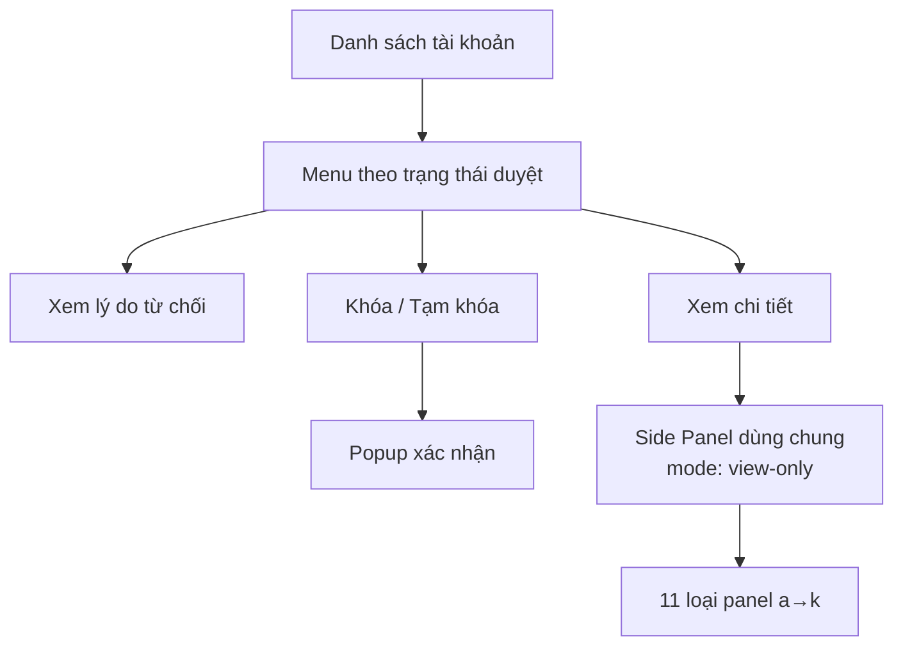
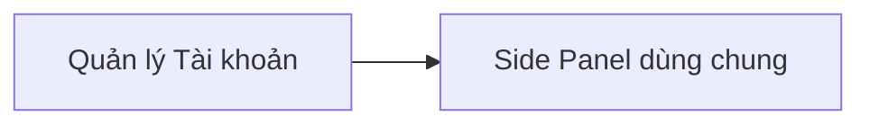

# Module: Quản lý Tài khoản

| Trường | Giá trị |
|--------|---------|
| **Pages** | 6–19 |
| **Ước lượng FE** | ~6,0 ngày (chưa gồm Side Panel dùng chung ~4,0 ngày) |
| **User Story** | QLTK_US1 – QLTK_US5 |
| **Phụ thuộc** | [Side Panel dùng chung](shared-detail-panel.md) — `mode: view-only` |

## Tổng quan

Quản lý tài khoản người dùng: danh sách, thao tác theo trạng thái duyệt, khóa/tạm khóa, xem chi tiết qua side panel read-only.

Page 10–19 là **mục 3.5** (side panel a→k) thuộc module này — không phải module riêng.

## Page liên quan

| Page | Nội dung |
|------|----------|
| 6 | Danh sách tài khoản (bảng đầy đủ ở Page 7) |
| 7 | Bảng chi tiết + menu thao tác theo trạng thái duyệt |
| 8 | Xem lý do từ chối; popup xác nhận khóa/tạm khóa |
| 9–19 | Side panel read-only (a. Bảo mật → k. Chi tiết gói DV) |

## Yêu cầu chức năng

| ID | Mô tả | Loại | Nguồn | Mức độ |
|---|---|---|---|---|
| REQ-ACC-001 | Hiển thị danh sách tài khoản user | Chức năng | Page 6–7 | Rõ |
| REQ-ACC-002 | Menu thao tác thay đổi theo trạng thái duyệt | Chức năng | Page 7 | Rõ |
| REQ-ACC-003 | "Từ chối duyệt" → thêm "Xem lý do từ chối" | Chức năng | Page 8 | Rõ |
| REQ-ACC-004 | Popup xác nhận khóa/tạm khóa | Chức năng | Page 8 | Rõ |
| REQ-ACC-005 | Side panel read-only, tái sử dụng Web Chuyên Gia | Chức năng | Page 9 | Rõ |
| REQ-ACC-006 | Ẩn nút, section Bảo mật thừa, bỏ icon xóa ảnh | Quy tắc | Page 9 | Rõ |
| REQ-ACC-007 | Tìm kiếm/lọc danh sách | Chức năng | — | `[GIẢ ĐỊNH]` |

## Quy tắc nghiệp vụ

- BR-ACC-001 `[ĐÃ XÁC NHẬN]`: Trạng thái "Từ chối duyệt" hiển thị option xem lý do.
- BR-ACC-002 `[ĐÃ XÁC NHẬN]`: Popup khóa/tạm khóa yêu cầu xác nhận.
- BR-ACC-003 `[ĐÃ XÁC NHẬN]`: Side panel khóa chế độ read-only.
- BR-ACC-004 `[CHƯA RÕ]`: Khác biệt giữa khóa và tạm khóa.

## Dữ liệu liên quan `[GIẢ ĐỊNH]`

| Đối tượng | Trường | Mô tả | Bắt buộc |
|---|---|---|---|
| UserAccount | userId | ID tài khoản | Có |
| UserAccount | name | Tên | Có |
| UserAccount | email | Email | Có |
| UserAccount | reviewStatus | Trạng thái duyệt | Có |
| UserAccount | rejectionReason | Lý do từ chối | Có điều kiện |
| UserAccount | lockStatus | Khóa / tạm khóa | Không |
| UserAccount | panelType | Loại side panel | Không |

## Vai trò sử dụng

- **Người dùng:** Admin Web Admin
- **Thao tác:** Xem danh sách, xem chi tiết, xem lý do từ chối, khóa/tạm khóa

## Câu hỏi cần khách xác nhận

1. Có bao nhiêu trạng thái duyệt? Ma trận chuyển trạng thái?
2. Khóa vs tạm khóa khác nhau thế nào?
3. Có cần tìm kiếm/lọc theo trạng thái?
4. Field nào hiển thị trên từng panelType?

## Luồng nghiệp vụ

## Phụ thuộc module

## Phân tích khoảng trống

- Chưa rõ nghiệp vụ khóa/tạm khóa.
- Chưa review ảnh UI để điền cột bảng thực tế.
- Estimate side panel nằm ở module dùng chung.

## Hạng mục triển khai (giao diện)

| Hạng mục | Quy mô | Ước lượng | Ghi chú |
|----------|--------|-----------|---------|
| Bảng tài khoản + menu theo trạng thái + tìm kiếm | M | 2,5–3,5 ngày | |
| Modal xem lý do từ chối | S | 0,5 ngày | |
| Popup xác nhận khóa/tạm khóa | S | 0,5–1 ngày | |
| Tích hợp Side Panel (`view-only`) | S | 1–1,5 ngày | Không build panel mới |

## Ước lượng FE (1 Senior)

| Hạng mục | Ngày |
|----------|------|
| Tổng (mid) | 5,0 |
| Dự phòng 20% | 1,0 |
| **Tổng cộng** | **~6,0** |

## User Story

| ID | Tên | Điểm |
|----|-----|------|
| QLTK_US1 | Danh sách tài khoản | M |
| QLTK_US2 | Menu theo trạng thái duyệt | S |
| QLTK_US3 | Side panel chỉ xem (shell) | S |
| QLTK_US4 | Xác nhận khóa / tạm khóa | S |
| QLTK_US5 | Panel theo loại đối tượng (a→k) | M |
