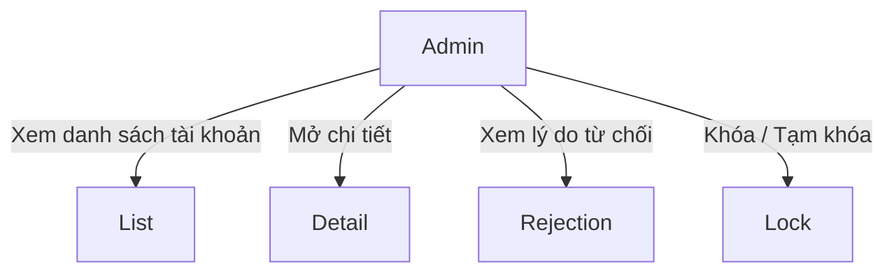
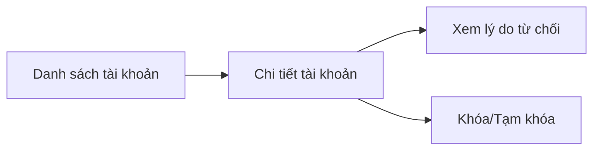
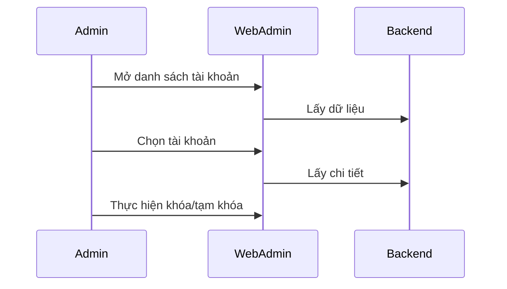
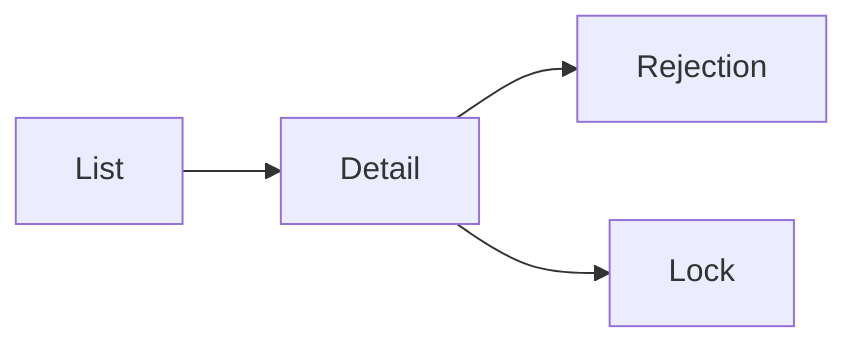

# Module: Quản lý danh sách tài khoản

## Nội dung chính
Module Quản lý danh sách tài khoản xử lý bảng danh sách tài khoản user, menu action theo trạng thái duyệt, popup khóa/tạm khóa và side panel read-only để xem chi tiết.

## Page liên quan
- Page 6: Danh sách tài khoản.
- Page 7: Bảng chi tiết tài khoản và menu theo trạng thái.
- Page 8: Option "Xem lý do từ chối" khi status = "Từ chối duyệt".
- Page 9: Side panel xem chi tiết read-only tái sử dụng UI web chuyên gia.

## Image Analysis (auto-generated)

- Page 6:
  - 6.1.png
- Page 7:
  - 7.1.png
- Page 8:
  - 8.1.png
  - 8.2.png
- Page 9:
  - 9.1.png

> Note: review each image and fill UI Elements / Visual cues accordingly.


## Requirement được phát hiện
| ID | Requirement | Loại | Actor liên quan | Mức độ rõ ràng |
|---|---|---|---|---|
| REQ-ACC-001 | Hiển thị danh sách tài khoản user. | Functional | Admin | Clear |
| REQ-ACC-002 | Hiển thị bảng chi tiết tài khoản với menu tương ứng theo trạng thái duyệt. | Functional | Admin | Clear |
| REQ-ACC-003 | Nếu status = "Từ chối duyệt", menu phải bổ sung option "Xem lý do từ chối". | Functional | Admin | Clear |
| REQ-ACC-004 | Cung cấp popup xác nhận khóa/tạm khóa tài khoản. | Functional | Admin | Clear |
| REQ-ACC-005 | Side panel chi tiết phải read-only và ẩn button / icon xóa. | Functional | Admin | Clear |

## Business Rule
- BR-ACC-001: Trạng thái "Từ chối duyệt" phải hiển thị option xem lý do.
- BR-ACC-002: Popup khóa/tạm khóa phải yêu cầu xác nhận.
- BR-ACC-003: Side panel chi tiết phải khóa chế độ read-only, ẩn tất cả button không cần thiết.

## Dữ liệu liên quan
| Data Object | Field / Attribute | Mô tả | Bắt buộc? | Ghi chú |
|---|---|---|---|---|
| UserAccount | userId | ID tài khoản | Yes | |
| UserAccount | name | Tên người dùng | Yes | |
| UserAccount | email | Email | Yes | |
| UserAccount | reviewStatus | Trạng thái duyệt | Yes | |
| UserAccount | rejectionReason | Lý do từ chối | Conditional | Chỉ khi status = "Từ chối duyệt" |
| UserAccount | lockStatus | Trạng thái khóa / tạm khóa | No | |
| UserAccount | detailPanelType | Loại panel chi tiết | No | |

## Actor / Role liên quan
- Actor: Admin Web Admin
- Vai trò: Quản lý tài khoản người dùng.
- Quyền/hành động:
  - Xem danh sách tài khoản.
  - Mở chi tiết tài khoản.
  - Xem lý do từ chối.
  - Khóa/tạm khóa tài khoản.
  - Xem detail read-only.

## Assumption
- Side panel đã có sẵn và chỉ hiển thị read-only.
- Admin không được chỉnh sửa nội dung trong side panel.
- Trạng thái duyệt xác định menu hiển thị tương ứng.

## Open Questions
- Có bao nhiêu trạng thái duyệt cụ thể?
- Khóa và tạm khóa khác nhau như thế nào?
- Có cần filter/search danh sách tài khoản theo trạng thái?
- Có cần hiển thị tab Bảo mật hoặc dữ liệu bổ sung trong side panel?

## Mermaid diagrams
### Use Case Diagram


### Business Flow Diagram


### Sequence Diagram


### Module Dependency Diagram


## Gap Analysis
- Chưa rõ nghiệp vụ khóa/tạm khóa chi tiết.
- Chưa xác định các trường cụ thể trong side panel.
- Chưa rõ tính năng tìm kiếm/lọc.

## Đề xuất kiến trúc sơ bộ
- Frontend: bảng tài khoản, menu theo trạng thái, popup xác nhận, side panel read-only.
- Backend: API danh sách tài khoản, API chi tiết, API khóa/tạm khóa, API lý do từ chối.
- Data: bảng `user_accounts`, bảng `account_status_changes` nếu cần lịch sử.

## Hidden requirements & Edge cases
- Status-driven UI: map đầy đủ `menu options` theo `reviewStatus` và test cho tất cả trạng thái biên.
- Lock vs temporary lock: cần xác định semantics (duration, reversible actions, auto-unlock) và hiển thị rõ cho admin.
- Sensitive data (PII) trong side panel: cần masking hoặc kiểm tra permission trước khi hiển thị đầy đủ.
- Bulk operations & performance: hỗ trợ bulk actions và đảm bảo `search/filter` hiệu quả trên large datasets.

## Implementation breakdown (frontend tasks)
- [UI][Medium] `UserAccountList` table với status-specific menus và search/filter. Est: 3–4d
- [UI][Small] `AccountDetailPanel` read-only side panel với các section conditional. Est: 1.5–2.5d
- [UI][Small] `LockConfirmPopup` và `ViewRejectionReason` modal. Est: 1–1.5d

<!-- Note: Integration, testing, and accessibility tasks intentionally excluded from this breakdown per request. -->

## FE Estimate (single senior FE)
- Sum (mid ranges): 6.75d
- Contingency 20%: 1.35d
- Total FE estimate: ~8.1d

```
