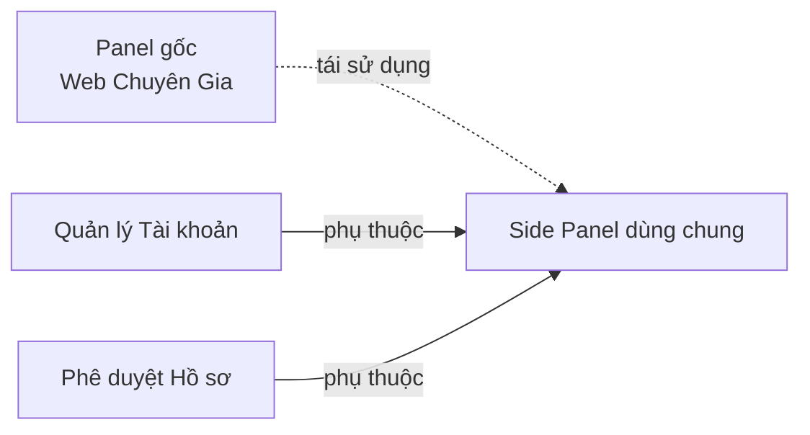
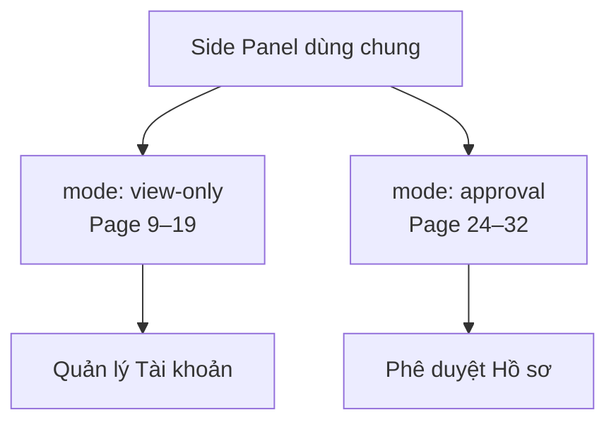

# Module: Side Panel dùng chung (Cross-cutting)

| Trường | Giá trị |
|--------|---------|
| **Pages** | 9–19 (chỉ xem), 24–32 (phê duyệt) |
| **Ước lượng FE** | ~4,0 ngày |
| **Phụ thuộc bởi** | Quản lý Tài khoản, Phê duyệt Hồ sơ & Gói DV |

## Tổng quan

Thư viện side panel tái sử dụng từ **Web Chuyên Gia**, dùng chung cho:

- **Quản lý Tài khoản** (Page 9–19) — chế độ `view-only`
- **Phê duyệt Hồ sơ & Gói DV** (Page 24–32) — chế độ `approval` (xem + chỉnh sửa dữ liệu + duyệt/từ chối)

> Module này không map 1:1 với từng page requirement mà là lớp dùng chung, tránh estimate trùng lặp.

## Các loại panel `[ĐÃ XÁC NHẬN]`

| panelType | Page (Tài khoản) | Page (Phê duyệt) | Mô tả |
|-----------|------------------|------------------|-------|
| `security` | 9a | — | Tab Bảo mật, ẩn section không cần |
| `account` | 10b | — | Thông tin tài khoản |
| `online-consulting` | 11c | 25 | Tư vấn online |
| `home-care` | 12d | 24 | Chăm sóc tại nhà |
| `clinic` | 13e | 26 | Phòng mạch |
| `expert-profile` | — | 27 | Profile chuyên gia |
| `medical-facility` | 15g | 28 | Cơ sở y khoa |
| `lab-center` | 16h | 29 | Trung tâm xét nghiệm |
| `pharmacy` | 17i | 30 | Nhà thuốc |
| `store` | 18j | 31 | Cửa hàng |
| `service-package-list` | 19k (danh sách) | 32 | Gói dịch vụ |
| `service-package-detail` | 19k (chi tiết) | 32 | Chi tiết gói dịch vụ |

## Chế độ panel (mode)

| Mode | Dùng tại | Hành vi |
|------|----------|---------|
| `view-only` | Quản lý Tài khoản | Ẩn nút thao tác, trường read-only, bỏ icon xóa ảnh |
| `approval` | Phê duyệt | Hiển thị Duyệt/Từ chối, cho phép chỉnh sửa dữ liệu `[CHƯA RÕ]` |

## Yêu cầu chức năng

| ID | Mô tả | Loại | Nguồn | Mức độ |
|---|---|---|---|---|
| REQ-SDP-001 | Tái sử dụng side panel từ Web Chuyên Gia | Chức năng | Page 9, 24 | Rõ |
| REQ-SDP-002 | Chế độ view-only: ẩn nút, read-only, bỏ icon xóa ảnh | Quy tắc | Page 9 | Rõ |
| REQ-SDP-003 | Tab Bảo mật: ẩn section không cần ở Web Admin | Quy tắc | Page 9 | Rõ |
| REQ-SDP-004 | Chế độ approval: hiển thị nút duyệt/từ chối | Chức năng | Page 24, 33 | Rõ |
| REQ-SDP-005 | Hiển thị đúng layout theo panelType | Chức năng | Page 10–19, 24–32 | Rõ |
| REQ-SDP-006 | Chỉnh sửa dữ liệu trong chế độ approval | Chức năng | Page 24 | `[CHƯA RÕ]` |

## Quy tắc nghiệp vụ

- BR-SDP-001 `[ĐÃ XÁC NHẬN]`: Panel gốc từ Web Chuyên Gia, không build lại từ đầu.
- BR-SDP-002 `[ĐÃ XÁC NHẬN]`: Chế độ view-only không cho phép chỉnh sửa bất kỳ trường nào.
- BR-SDP-003 `[ĐÃ XÁC NHẬN]`: Dropdown/toggle ở panel gốc chỉ hiển thị giá trị hiện tại, không mở menu.
- BR-SDP-004 `[CHƯA RÕ]`: Phạm vi trường được sửa khi phê duyệt — chờ khách xác nhận.

## Dữ liệu liên quan `[GIẢ ĐỊNH]`

| Đối tượng | Trường | Mô tả |
|---|---|---|
| DetailPanelConfig | panelType | Loại panel |
| DetailPanelConfig | mode | `view-only` \| `approval` |
| DetailPanelConfig | hiddenSections | Section ẩn theo mode/ngữ cảnh |
| DetailPanelData | fields | Dữ liệu hiển thị (từ API) |

## Sơ đồ phụ thuộc

## Sơ đồ chế độ panel

## Phân tích khoảng trống

- Chưa rõ danh sách field từng panelType (cần review ảnh UI).
- Phạm vi chỉnh sửa dữ liệu khi phê duyệt chưa xác định.
- Panel `expert-profile` chỉ có ở luồng phê duyệt.

## Hạng mục triển khai (giao diện)

| Hạng mục | Quy mô | Ước lượng |
|----------|--------|-----------|
| `DetailPanelShell` — wrapper mode + vòng đời panel | M | 1–1,5 ngày |
| `ReadOnlyField` — chuyển control chỉnh sửa sang hiển thị | S | 0,5–1 ngày |
| `PanelTypeRegistry` — mapping 11 loại panel | M | 1–1,5 ngày |
| `SecurityTabView` — ẩn section theo cấu hình | S | 0,5–1 ngày |

## Ước lượng FE (1 Senior)

| Hạng mục | Ngày |
|----------|------|
| Tổng (mid) | 3,3 |
| Dự phòng 20% | 0,7 |
| **Tổng cộng** | **~4,0** |

## User Story liên quan

Không có user story riêng — được sử dụng bởi: `QLTK_US3`, `QLTK_US5`, `PDHS_US3`, `PDHS_US5`
